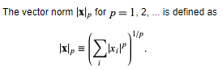

## Lecture 0

### RGB


RGB are values that specify the scale of the basis RGB vector.


- Is reflection = absorption + emission?

In reality, we have multiple interactions, diffused surface (scattering), ... We will make simplified assumptions:

- Wavelength independence (No fluorescence (荧光), we will have red in red out, no change of color during reflection)
  - We can independently compute red, blue and green channels
- Time invariance (No phosphorescence, immediate reflection, no delay)
- Light transport in a vacuum, no friction.
- Isotropic objects (for now), reflectances are constant over the surface (e.g. same color, no dots on ball).

There are 6 millions cones in the fovea and 120 million rods over the whole eyes, they sense Red, Green and Blue color.


In real-time graphics, there are more assumptions:

- ignore spectral distribution
- Takes 3 discrete wavelength basis functions: red, green and blue.
- Approximation
- Metamerism
  - Different spectrum
  - Same percept and RGB

### Main Concepts

- Rendering
  - Scene definition (View independence)
    - View volume, clipping (reduce world definition)
  - View (Independent of light or geometry)
  - Methods.
- Anti-aliasing
  
- Projection
  - Near & Far, size depend on distance
- Occlusion
  
- Lighting
  - Global & Local illumination.

## Lecture 1

### Maths

- Point

- Vector

  - vector norm is the absolute value of the vector, norm2 refers to square,
    - 
  - Length $|v|=\sqrt{x^2+y^2+z^2}$.
  - normalize $v_{\text{unit}}=\frac{v}{|v|}$.
    
  - Dot product $u\cdot v=x_ux_v+y_uy_v+z_uz_v=|u||v|\cos \theta$.
    - Useful for finding angle of two vectors.
    - If $u$ and $v$ are unit vector, then it is just $\cos \theta$.
  - Cross product: new vector that is normal to the two.

- Matrix

  - scale: diagonal

  - rotate

    - 2D
      $$
      R(x, y, \theta)=
      \begin{bmatrix}
      \cos(\theta)& -\sin(\theta)\\
      \sin(\theta)& \cos(\theta)
      \end{bmatrix}
      \begin{bmatrix}
      x\\
      y
      \end{bmatrix}
      $$
    
  - 3D
    
    - along x
        $$
        R_x(x, y, z, \theta)=
        \begin{bmatrix}
        1&0&0\\
        0&\cos(\theta)& -\sin(\theta)\\
        0&\sin(\theta)& \cos(\theta)
        \end{bmatrix}
        \begin{bmatrix}
        x\\
        y\\
        z
        \end{bmatrix}
        $$
    
    - along y
        $$
        R_y(x, y, z, \theta)=
        \begin{bmatrix}
        \cos(\theta)&0&-\sin(\theta)\\
        0&1&0 \\
        \sin(\theta)&0& \cos(\theta)
        \end{bmatrix}
        \begin{bmatrix}
        x\\
        y\\
        z
        \end{bmatrix}
        $$
    
    - along z
        $$
        R_y(x, y, z, \theta)=
        \begin{bmatrix}
        \cos(\theta)&-\sin(\theta)&0\\
        \sin(\theta)& \cos(\theta)&0\\
        0&0&1
        \end{bmatrix}
        \begin{bmatrix}
        x\\
        y\\
        z
        \end{bmatrix}
        $$
  
- Translation: homogenous points
    $$
    T(x,y,z,a,b,c)=
    \begin{bmatrix}
    1&0&0&0\\
    0&1&0&0\\
    0&0&1&0\\
    a&b&c&1\\
    \end{bmatrix}
    \begin{bmatrix}
    x\\
    y\\
    z\\
    1
    \end{bmatrix}
    $$

We can combine scale, rotation, translation operation into one matrix.

- pythagoras theorem, if not at origin then subtract to origin first.


## Lecture 2

### Illumination


- Ambient
  - We approximate global illumination by giving object a constant color.
  - A global ambient light $I_a$, and each object reflect a proportion $k_r$, so we have  $I_r=k_rI_a$.
- Diffuse
  - According to Lambert's Law, light will scatter when it hits a surface on a microscopic level according to a diffuse factor. We can approximate this effect as people find that the amount of light reflected is roughly proportional to the cosine angle between the reflected ray and the reflecting surface normal.
    
  - The cosine angle is just the dot product of the two vectors, note they have to be unit vector otherwise it will be scaled by the length.
  - 


# Miscellaneous

### Ray-Sphere Intersection

 https://viclw17.github.io/2018/07/16/raytracing-ray-sphere-intersection/

```python
struct Ray {
    vec3 origin
    vec3 direction
}

struct Sphere {
    vec3 origin
    float radius
}

def intersect(ray, sphere) -> bool:
	# (outer - center)^2 = r^2
    # outer = ray(t) = origin + t * direction
    # (O + tD - center)^2 = r^2
    # t^2D^2 + 2tD - (O-center)^2 - r^2 = 0
    
    O_center = ray.origin - sphere.origin
    c = o_center ** 2
    a = ray.direction ** 2
    b = 2 * ray.direction * o_center
    det = (b ** 2) - (4 * a * c)
    if det < 0: # miss
        return False
    
    
```

