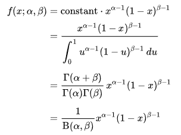
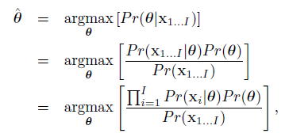

# Machine Vision

The big goal of machine vision is to:

- Recognition
  - Character / Face / Object / Action
- Reconstruction
  - 2D image $\rightarrow$ 3D model
- Tracking
  - Follow object in video
- Navigation
- Segmentation
- Enhancement Synthesis
- ...

Applications includes:

- Autonomous Vehicles
- Security
- Text Recognition
- Augmented Reality
- Image Retrieval
- Medical Image Analysis
- Model Building
- ...

History:

- 1970s: low level vision with binary images
- 1980s:  close with animal vision
- 1990s: estimation of camera pose and scene geometry
- 2000s: close with ML, CNN...

## Introduction

Machine Vision is hard because of (1) its dimensionality, all combinations of pixel values is a huge number (though we will never see most of them); (2) It is a inverse problem, i.e. the mapping from scene to image is many-to-one, it is not unique; (3) real-time is hard because video contains many data. Luckily, we know about how graphics works, have prior knowledge that expects what we will see in the image (help non-uniqueness), and there are huge data available.

## Overview

1. Probability

   - Joint probability

   - Conditional probability

   - Independence

   - Bayes’ rule

   - Common probability distributions

   - How to fit distributions to data

   - The multivariate normal

2. ML for vision: infer world from data

   - Model for regression (Discriminative)

     - Linear & non-linear regression
     - Gaussian process regression
     - The relevance vector machine

     - Models for classification (Discriminative)
       - Logistic regression
       - Gaussian process classification
       - Boosting and classification trees

   - Model complex PDFs (Generative)
     - EM algorithm
     - Mixture models
     - t-distributions
     - Factor Analysis

3. Connecting Models

   - Conditional Independence

   - Graphical Models

   - Inference on tree-structured models

   - Pictorial Structures

   - Undirected models

   - Markov random fields

   - Graph cuts

4. Models of Shape

   - Point distribution model

   - Active Shape Models

   - Active appearance models

5. Tracking

   - The Kalman Filter

   - Extensions of the Kalman Filter

   - Particle Filtering

6. Face Recognition

   - Subspace models for recognition

   - Within- and between- individual variance

   - Recognition across pose

7. Geometry of a Single Camera

   - Image transformations
   - How do 3d points project to pixels
   - Special cases of imaging

8. Geometry of multiple cameras

   - Stereo vision
   - Epipolar geometry
   - Finding and matching distinctive keypoints 
   - Shape from silhouette

## Probability

- **Random Variable** Output of a function that you do not know the input, the function can be discrete or continuous.

- **Probability** Probability of a output from a random variable.

- **Joint Probability** Probability of two random variable outputs happen together.
  $$
  \begin{split}
  Pr(x|y)&=\frac{Pr(x,y)}{Pr(y)}
  \end{split}
  $$

- **Bayes Rule**
  $$
  \begin{split}
  Pr(y|x)=\frac{Pr(x|y)Pr(y)}{Pr(x)}
  \end{split}
  $$
  $Pr(y)$ can be seem as remove the denominator in $Pr(x|y)$ to get $Pr(x,y)$ and add $Pr(x)$ to get $Pr(y|x)$.

- **Expectation**
  $$
  E[f(x)]=\int{f(x)Pr(x)}\; dx
  $$

  - Calculating the expectation requires us to know probability of each input.

  > TODO: what is moment

### Probability Distributions

### Bernoulli

> univariant, discrete, binary

$$
Pr(x)=Bern_x[\lambda]
$$

where
$$
\begin{align*}
Pr(1)&=\lambda\\
Pr(0)&=1-\lambda\\

\lambda&\in [0, 1]\\
x&\in\{0, 1\}

\end{align*}
$$
Or in one line:
$$
Pr(x)=\lambda^x(1-\lambda)^{1-x}
$$
The probability will sum to one of-course.

### Beta

> univariant, continuous, multivalues

If our $\lambda$, parameter of the Bernoulli distribution is also following a distribution, then by observing the distribution, we can tell the probability of $1$ and $0$ because they are controlled by the $\lambda$. In the beta distribution, the distribution of $\lambda$ is controlled by $\alpha$ and $\beta$.

Note that the ratio of $\alpha$ and $\beta$ determine where the peak is, and the magnitude of $\alpha$ and $\beta$ determine how steep the peak is. If it is $(1, 1)$, the distribution will be flat, but if we have $(10, 10)$, then we will get a peak at the middle. In short we write:
$$
Pr(\lambda)=Beta_\lambda[\alpha, \beta]
$$

### Categorical

But what if we want to model distribution of a number of values, not just $1$ and $0$? Then we will extend the above to include multiple $\lambda$, store them in a vector denoted as $\boldsymbol{\lambda}$ where each of $\lambda_i\in \boldsymbol\lambda$ represents the probability of $x_i$. Then this is called a categorical distribution. of-course, these $\lambda_i$ has to sum to 1 so that the overall probability is 1.

### Dirichlet

Now if $\boldsymbol\lambda$  (not individual $\lambda_i$)  follows a distribution, then we have a dirichlet distribution, controlled by parameter $\alpha_i$:

If we assume we have 3 $\lambda$s, then from the figure above, we have see that the color will be flat if we have all of them the same, and if they are different, that tells us that some combinations of $\lambda$ are more probable.

### Univariate Normal

$\mu$ describe the position of the distribution along the $x$ axis, $\sigma$ describe the variance of the distribution.

### Normal Inverse Gamma

We can model the distribution of the $\mu$ and $\sigma$ using 4 parameters: 

- $\alpha$: control the position of center.
- $\beta$: controls the amount spread from the center.
- $\gamma$: control the variance.
- $\var$: control the position along the $x$ axis.

### Multivariate Normal

### Normal Inverse Wishart

### Conjugate

|                     | conjugate to |                             |
| ------------------- | ------------ | --------------------------- |
| Bernoulli           |              | Beta                        |
| categorical         |              | dirichlet                   |
| univariate normal   |              | normal-scaled inverse gamma |
| multivariate normal |              | normal inverse wishart      |

## Fitting data to normal distribution

- The input data: $X$.
- The size of $X$: $I$.

### Maximum Likelihood

We calculate the mean and variance of the data:
$$
\begin{align*}
\hat{\mu}&=\text{mean}(X)&=&\frac{\sum_{i=1}^I(x_i)}{I}\\
\hat{\sigma}^2&=\text{variance(X)}&=&\frac{\sum_{i=1}^{I}(x_i-\hat{\mu})^2}{I}
\end{align*}
$$

### Maximize a Posterior

Same as the Maximum Likelihood, except we have additional information, the prior $\hat{\mu}$ and $\hat{\sigma}^2$, which allow us to configure out the probability of the new  $\hat{\mu}$ and $\hat{\sigma}^2$ given the old  $\hat{\mu}$ and $\hat{\sigma}^2$. So instead of maximizing:

We do:

### Bayesian

Here instead of trying to predict a certain $\hat{\theta}$, we compute a probability distribution for all $\theta$ using bayesian rule:

when given a new data, we compute its probability using:

It is probability of new data given a configuration, multiply by the probability of that configuration.

## Model Complex Distribution

### Maximum Likelihood

Let's say we want to model the probability distribution of a image containing face. In the first attempt we use a normal distribution:
$$
Pr(x)=\text{Norm}[\mu,\sigma^2]
$$
where:

- $x$ is the image pixel.
- $\mu$ is the mean of the normal distribution.
- $\sigma$ is the standard deviation and $\sigma^2$ covariance of the normal distribution.

The process of finding $\mu$ and $\sigma$ that best model the probability distribution, can be represented as:
$$
\hat{\mu},\hat{\sigma}^2=\underset{\mu,\sigma^2}{\text{argmax}}\left(\prod_{i=1}^{I}\text{Norm}_{x_i}[\mu,\sigma^2]\right)
$$
where:

- $I$ is the number of samples.
- $\text{Norm}_{x_i}[\mu,\sigma^2]$ is the probability of the current pixel $x_i$ under the chosen $\mu$ and $\sigma^2$.

This is just the mathematic way of saying we want to find the optimal $\mu$ and $\sigma^2$ which best fit the distribution of $x$. But more often, we will take the sum of logarithm instead of the product of all probability of $x$:
$$
\hat{\mu},\hat{\sigma}^2=\underset{\mu,\sigma^2}{\text{argmax}}\left(\sum_{i=1}^{I}\log\left(\text{Norm}_{x_i}[\mu,\sigma^2]\right)\right)
$$
This is because probability of any given $x_i$ is represented as a decimal between $0$ and $1$. If we multiply such number repeatedly, then it will keep getting smaller (e.g. $0.5\times 0.5=0.25$), and at the end it will out of the precision range of the computer (if we have a lot of samples).
$$
\begin{align*}
&\underset{\mu,\sigma^2}{\text{argmax}}\left(\sum_{i=1}^{I}\log\left(\text{Norm}_{x_i}[\mu,\sigma^2]\right)\right)\\
=&\underset{\mu,\sigma^2}{\text{argmax}}\left(-0.5I\log(2\pi)-0.5I\log\sigma^2-0.5\sum_{i=1}^{I}\frac{(x_i-\mu)^2}{\sigma^2}\right)
\end{align*}
$$
Now if we differentiate with respect to $\mu$ we get:
$$
\begin{align*}
\frac{\partial L}{\partial{\mu}}&=\sum^{I}_{i=1}\frac{x_i-\mu}{\sigma^2}\\
&=\frac{\sum_{i=1}^Ix_i}{\sigma^2}-\frac{I\mu}{\sigma^2}\\
\hat{\mu}&=\frac{\sum{_{i=1}^{I}x_i}}{I}\\
&=\text{mean}(x)
\end{align*}
$$
and similarly for $\sigma$:
$$
\hat{\sigma}^2=\sum_{i=1}^I\frac{(x_i-\hat{\mu})^2}{I}
$$
This is the called maximum likelihood for normal distribution, we fit a normal distribution to the given data.

### Maximum a Posterior

Now, what if we have some prior knowledge about the data? For example, we have a previous version of the data and we know its probability distribution, how do we utilize this information? Well, this is where bayesian rule is used, the rule says:
$$
Pr(\theta|x)=\frac{Pr(x|\theta)Pr(\theta)}{Pr(x)}
$$
where $\theta$ is the distribution. To maximize $\theta$ in this term is same as maximizing the numerator only, as the denominator is same for all $\theta$.

### Bayesian Approach

Now instead of find the best $\theta$, why don't we have a probability distribution over all $\theta$? Because although some theta does not fit best into the data, they are still probable.

From the bayesian rule, you can see that it result in a probability over all possible distributions given the past information, so in order to calculate the probability of the new data, we do:
$$
Pr(x^*|x_{1\dots I})=\int Pr(x^*|\theta)Pr(\theta|x_{1\dots I})\;d\theta
$$
This means for every possible distribution we compute the probability of the new data has on it, then scale it by the probability of it on the old data.
