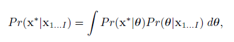

# Machine Vision

> Book: http://www.computervisionmodels.com/

The big goal of machine vision is to:

- Recognition
  - Character / Face / Object / Action
- Reconstruction
  - 2D image $\rightarrow$ 3D model
- Tracking
  - Follow object in video
- Navigation
- Segmentation
- Enhancement Synthesis
- ...

Applications includes:

- Autonomous Vehicles
- Security
- Text Recognition
- Augmented Reality
- Image Retrieval
- Medical Image Analysis
- Model Building
- ...

History:

- 1970s: low level vision with binary images
- 1980s:  close with animal vision
- 1990s: estimation of camera pose and scene geometry
- 2000s: close with ML, CNN...

## Introduction

Machine Vision is hard because of (1) its dimensionality, all combinations of pixel values is a huge number (though we will never see most of them); (2) It is a inverse problem, i.e. the mapping from scene to image is many-to-one, it is not unique; (3) real-time is hard because video contains many data. Luckily, we know about how graphics works, have prior knowledge that expects what we will see in the image (help non-uniqueness), and there are huge data available.

## Overview

1. Probability

   - Joint probability

   - Conditional probability

   - Independence

   - Bayes’ rule

   - Common probability distributions

   - How to fit distributions to data

   - The multivariate normal

2. ML for vision: infer world from data

   - Model for regression (Discriminative)

     - Linear & non-linear regression
     - Gaussian process regression
     - The relevance vector machine

     - Models for classification (Discriminative)
       - Logistic regression
       - Gaussian process classification
       - Boosting and classification trees

   - Model complex PDFs (Generative)
     - EM algorithm
     - Mixture models
     - t-distributions
     - Factor Analysis

3. Connecting Models

   - Conditional Independence

   - Graphical Models

   - Inference on tree-structured models

   - Pictorial Structures

   - Undirected models

   - Markov random fields

   - Graph cuts

4. Models of Shape

   - Point distribution model

   - Active Shape Models

   - Active appearance models

5. Tracking

   - The Kalman Filter

   - Extensions of the Kalman Filter

   - Particle Filtering

6. Face Recognition

   - Subspace models for recognition

   - Within- and between- individual variance

   - Recognition across pose

7. Geometry of a Single Camera

   - Image transformations
   - How do 3d points project to pixels
   - Special cases of imaging

8. Geometry of multiple cameras

   - Stereo vision
   - Epipolar geometry
   - Finding and matching distinctive keypoints 
   - Shape from silhouette

## Probability

- **Random Variable** Output of a function that you do not know the input, the function can be discrete or continuous.

- **Probability** Probability of a output from a random variable.

- **Joint Probability** Probability of two random variable outputs happen together.
  $$
  \begin{split}
  Pr(x|y)&=\frac{Pr(x,y)}{Pr(y)}
  \end{split}
  $$

- **Bayes Rule**
  $$
  \begin{split}
  Pr(y|x)=\frac{Pr(x|y)Pr(y)}{Pr(x)}
  \end{split}
  $$
  $Pr(y)$ can be seem as remove the denominator in $Pr(x|y)$ to get $Pr(x,y)$ and add $Pr(x)$ to get $Pr(y|x)$.

- **Expectation**
  $$
  E[f(x)]=\int{f(x)Pr(x)}\; dx
  $$

  - Calculating the expectation requires us to know probability of each input.

  > TODO: what is moment

### Probability Distributions

> The explicit formula is not discussed, they are created by mathematician for us to model probabilistic distribution to have some mathematically convenient properties.

### Bernoulli

> univariant, discrete, binary

$$
Pr(x)=Bern_x[\lambda]
$$

where
$$
\begin{align*}
Pr(1)&=\lambda\\
Pr(0)&=1-\lambda\\

\lambda&\in [0, 1]\\
x&\in\{0, 1\}

\end{align*}
$$
Or in one line:
$$
Pr(x)=\lambda^x(1-\lambda)^{1-x}
$$
- A probability distribution for two discrete values.

### Beta

> univariant, continuous, multivalues

$$
Pr(\lambda)=Beta_\lambda[\alpha, \beta]
$$

Beta distribution is used to represent a distribution of a value ranged between 0 and 1, called $\lambda$, controlled by $\alpha$ and $\beta$.

- The ratio of $\alpha$ and $\beta$ determine where the peak/expectation is.
- As the magnitude of $\alpha$ and $\beta$ increases, the steepness/concentration of the peak/expectation increase.
- This can be seen as an input for Bernoulli distribution.
- Expectation can be calculated as $\frac{\alpha}{\alpha+\beta}$.

> TODO: usage

### Categorical

- multi-values version of Bernoulli distribution.
  - Each value $x_i$ follows $Pr(x=x_i)=\lambda_i$ and $Pr(x\neq x_i)=1-\lambda_i$.

### Dirichlet

- Continuous version of Categorical distribution.
- Multi-values version of Beta distribution.
  - Relative ratio of $a_{i\in K}$ determine the peak/expectation value.
  - Absolute value of $a_{i\in K}$ determine the height/concentration of the peak.

### Univariate Normal

- $\mu$ describe the position of the peak.
- $\sigma$ describe the variance/width of the distribution.

### Normal Inverse Gamma

We model the distribution of the $\mu$ and $\sigma$ using 4 parameters: 

- $\alpha$: control the position of center, up or down.
- $\beta$: controls the spread of the center within the variance.
- $\gamma$: control the spread of variance.
- $\delta$: control the position of the center, left or right.

### Multivariate Normal

- multi-value version of univariate normal
  - multiple positions, multiple variances, each control its own axes.

### Normal Inverse Wishart

- Suitable for describing uncertainty in the parameters of a multivariate normal distribution. Similar to Beta describing the parameter of Bernoulli; and normal inverse gamma describing parameters of univariate normal.
- It is just a function that produces a positive value for any valid mean vector µ and covariance matrix Σ, such that when we integrate over all possible values of µ and Σ, the answer is one.

- α spread of covariance
- Ψ average covariance
- γ spread of mean
- δ average mean

### Conjugate

|                     | conjugate(*similar*) to |                             |
| ------------------- | ----------------------- | --------------------------- |
| Bernoulli           |                         | Beta                        |
| categorical         |                         | dirichlet                   |
| univariate normal   |                         | normal-scaled inverse gamma |
| multivariate normal |                         | normal inverse wishart      |

When we multiply a distribution with its conjugate, the result is proportional to a new distribution which has the same form as the conjugate. For example:
$$
\operatorname{Bern}_{x}[\lambda] \cdot \operatorname{Beta}_{\lambda}[\alpha, \beta]=\kappa(x, \alpha, \beta) \cdot \operatorname{Beta}_{\lambda}[\tilde{\alpha}, \tilde{\beta}]
$$
where κ is a scaling factor that is constant respect to our variables. Proof:
$$
\begin{aligned}
\operatorname{Bern}_{x}[\lambda] \cdot \operatorname{Beta}_{\lambda}[\alpha, \beta] &=\lambda^{x}(1-\lambda)^{1-x} \frac{\Gamma[\alpha+\beta]}{\Gamma[\alpha] \Gamma[\beta]} \lambda^{\alpha-1}(1-\lambda)^{\beta-1} \\
&=\frac{\Gamma[\alpha+\beta]}{\Gamma[\alpha] \Gamma[\beta]} \lambda^{x+\alpha-1}(1-\lambda)^{1-x+\beta-1} \\
&=\frac{\Gamma[\alpha+\beta]}{\Gamma[\alpha] \Gamma[\beta]} \frac{\Gamma[x+\alpha] \Gamma[1-x+\beta]}{\Gamma[x+\alpha+1-x+\beta]} \operatorname{Beta}_{\lambda}[x+\alpha, 1-x+\beta] \\
&=\kappa(x, \alpha, \beta) \cdot \operatorname{Beta}_{\lambda}[\tilde{\alpha}, \tilde{\beta}]
\end{aligned}
$$

## Fitting data to normal distribution

- The input data: $X$.
- The size of $X$: $I$.

### Maximum Likelihood

We estimate the parameters using:
$$
\begin{aligned}
\hat{\boldsymbol{\theta}} &=\underset{\boldsymbol{\theta}}{\operatorname{argmax}}\left[\operatorname{Pr}\left(\mathbf{x}_{1 \ldots I} \boldsymbol{\theta}\right)\right] \\
&=\underset{\boldsymbol{\theta}}{\operatorname{argmax}}\left[\prod_{i=1}^{I} \operatorname{Pr}\left(\mathbf{x}_{i} \mid \boldsymbol{\theta}\right)\right]
\end{aligned}
$$
This is because in order to achieve maximum, $\theta$ must be configured such that its distribution closely fits the actual data $x_i$, because $Pr(x|\theta)=Pr(x,\theta)/Pr(\theta)$, by assuming that the distribution of $\theta$ is uniform, we need to maximize the overlapping area of $\theta$ and $x$, this is achieved when $\theta$ and $x$ have the same shape, i.e. same distribution.

To do this, we calculate the mean and variance of the data, in the case of modeling using Gaussian distribution.
$$
\begin{align*}
\hat{\mu}&=\text{mean}(X)&=&\frac{\sum_{i=1}^I(x_i)}{I}\\
\hat{\sigma}^2&=\text{variance(X)}&=&\frac{\sum_{i=1}^{I}(x_i-\hat{\mu})^2}{I}
\end{align*}
$$

### Maximize a Posterior

Now, what if our prior is not uniform? i.e. we already had some previous data available that hints us about what will happen. the prior $\hat{\mu}$ and $\hat{\sigma}^2$, which allow us to configure out the probability of the new  $\hat{\mu}$ and $\hat{\sigma}^2$ given the old  $\hat{\mu}$ and $\hat{\sigma}^2$. So we do:

$$
\begin{aligned}
\hat{\boldsymbol{\theta}} &=\underset{\boldsymbol{\theta}}{\operatorname{argmax}}\left[\operatorname{Pr}\left(\boldsymbol{\theta} \mid \mathrm{x}_{1 \ldots I}\right)\right] \\
&=\underset{\boldsymbol{\theta}}{\operatorname{argmax}}\left[\frac{\operatorname{Pr}\left(\mathrm{x}_{1 \ldots I} \mid \theta\right) \operatorname{Pr}(\boldsymbol{\theta})}{\operatorname{Pr}\left(\mathrm{x}_{1 \ldots I}\right)}\right] \\
&=\underset{\boldsymbol{\theta}}{\operatorname{argmax}}\left[\frac{\prod_{i=1}^{I} \operatorname{Pr}\left(\mathrm{x}_{i} \mid \boldsymbol{\theta}\right) \operatorname{Pr}(\boldsymbol{\theta})}{\operatorname{Pr}\left(\mathrm{x}_{1 \ldots I}\right)}\right]\\
&=\underset{\boldsymbol{\theta}}{\operatorname{argmax}}{\prod_{i=1}^{I} \operatorname{Pr}\left(\mathrm{x}_{i} \mid \boldsymbol{\theta}\right) \operatorname{Pr}(\boldsymbol{\theta})}

\end{aligned}
$$

### Bayesian

Here instead of trying to predict a certain $\hat{\theta}$, we compute a probability distribution for all $\theta$ using bayesian rule:

when given a new data, we compute its probability using:

It is probability of new data given a configuration, multiply by the probability of that configuration.

The goal is to calculate the probability of each configuration:
$$
P(\theta \mid D)=\frac{\overbrace{P(D \mid \theta)}^{likelihood} \overbrace{P(\theta)}^{prior}}{P(D)}=\frac{P(D \mid \theta) P(\theta)}{\int_{\theta} P(D \mid \theta) P(\theta) d \theta}
$$

-  A delta function δ[z] is a function that integrates to one, and that returns zero everywhere except at z = 0. 

### Comparison

> https://towardsdatascience.com/mle-map-and-bayesian-inference-3407b2d6d4d9

ML maximize $P(x|\theta)$ and MAP maximize $P(\theta|x)$, they return a single value, thus point estimator. Bayesian inference calculates the full posterior distribution, thus it return a PDF.

- Other point estimator exists such as expect a posterior (EAP)

### Covariance

Here we introduce three type of covariances:
$$
\boldsymbol{\Sigma}_{\text {spher }}=\left[\begin{array}{cc}
\sigma^{2} & 0 \\
0 & \sigma^{2}
\end{array}\right] \quad \boldsymbol{\Sigma}_{\text {diag }}=\left[\begin{array}{cc}
\sigma_{1}^{2} & 0 \\
0 & \sigma_{2}^{2}
\end{array}\right] \quad \boldsymbol{\Sigma}_{\text {full }}=\left[\begin{array}{cc}
\sigma_{11}^{2} & \sigma_{12}^{2} \\
\sigma_{21}^{2} & \sigma_{22}^{2}
\end{array}\right]
$$

- Spherical: scaled identity.
- Diagonal: diagonal.
- Full: symmetric and positive definite.

### Properties

If we have normal distribution of variable $x$:
$$
Pr(x)=\operatorname{Norm}_x[\mathbf{\mu}, \mathbf{\Sigma}]
$$
Then we have variable $y=Ax+b$ then its corresponding normal distribution is:
$$
Pr(x)=\operatorname{Norm}_x[A\mu+b, A\Sigma A^T]
$$
So to draw a sample of any distribution by transforming it from the standard normal distribution (mean 0, covariance identity), we first draw $x$ from a normal distribution, then apply $y=\Sigma^{-1}x+\mu$.

> TODO: how is this dervied

- If we marginalize a multi-variate normal, then the result also follows normal distribution

- If we condition on a subset of multi-variate normal on the using the rest of the variables, the conditioned distribution is also normal.

- The product of two normal distribution is also another normal distribution:
  $$
  \begin{aligned}
  \operatorname{Norm}_{\mathbf{x}}[\mathbf{a}, \mathbf{A}] \operatorname{Norm}_{\mathbf{x}}[\mathbf{b}, \mathbf{B}] =
  \kappa \cdot \operatorname{Norm}_{\mathbf{x}} {\left[\left(\mathbf{A}^{-1}+\mathbf{B}^{-1}\right)^{-1}\left(\mathbf{A}^{-1} \mathbf{a}+\mathbf{B}^{-1} \mathbf{b}\right),\left(\mathbf{A}^{-1}+\mathbf{B}^{-1}\right)^{-1}\right] }
  \end{aligned}
  $$
  

- If  we have normal distribution over a variable $x=Ay+b$, then we can express the same normal distribution in term of $y=A'x+b'$ as well. It is often used in bayesian rule to move $P(x|y)$ to  $P(y|x)$.

## Computer Vision

We take visual data $x$, infer world state $w$ (discrete/continuous), the measure data $x$ is often noisy and can map to many $w$, so best we can do is return a posterior distribution $P(w|x)$. We need **model**  to relate $x$ and $w$; **learning algorithm** that takes a pair of $(x_i, w_i)$ to fit parameters $\theta$; and an **inference algorithm** that takes the model and a new $x$ and return the probability distribution of the world $P(w|x,\theta)$, or draw sample from learned posterior.

- Inference is simpler with discriminative model, because we can directly compute $P(w|x)$; generative model make inference via bayesian rule which can be computational expensive.
- Generative model is built on $P(x|w)$ and discriminative model built on $P(w|x)$. Since the world space can be much smaller than the data, e.g. image space vs some aspect of the world, it may be more costly to build discriminative model.
  Secondly, the parameter used to describe the data maybe much larger than describing the world, even thought both configuration describing the data maybe referring to the same world state, and these redundancy can be expensive.
- The process of how data is created is more close to $P(x|w)$, we can account for perspective projection and occulusion, other approach requires learning these phenomena from the data.
- Generative model model the joint distribution over all data dimensions and can effectively interpolate missing elements.
- Generative model allows us to use expert prior knowledge as prior, which is harder for discriminative model.

Generative models are more common.

Applications include: skin detection and background subtraction.

## Normal Distribution

### Why multivariate model may not work

- It is unimodal, may not represent well by a single peak.
- not robust, single outlier can dramatically affects the estimate of the mean and covariance.
- too many parameters, the covariance matrix contains $D(D+1)/2$ parameters, sometimes forced to use diagonal form.

### Hidden Variable

Just a unknown distribution, we will then have a joint probability and we will marginalize it out later:
$$
\operatorname{Pr}(\mathbf{x} \mid \boldsymbol{\theta})=\int \operatorname{Pr}(\mathbf{x}, \mathbf{h} \mid \boldsymbol{\theta}) d \mathbf{h}
$$
The model involved often have hidden variable, in these cases, it will have neat close form solution only if we consider the hidden variable (which we cannot as it is hidden). We now need to apply non-linear optimization techniques or the expectation maximization algorithm to the right hand side of below equation, similar to ML:
$$
\hat{\boldsymbol{\theta}}=\underset{\boldsymbol{\theta}}{\operatorname{argmax}}\left[\sum_{i=1}^{I} \log \left[\int \operatorname{Pr}\left(\mathbf{x}_{i}, \mathbf{h}_{i} \mid \boldsymbol{\theta}\right) d \mathbf{h}_{i}\right]\right]
$$

### EM Algorithm

> skipped

### Mixture of Gaussian

Mixture of Gaussian is a model that suitable for EM algorithm, it describe data as sum of $K$ normal distributions.
$$
\begin{aligned}
\hat{\boldsymbol{\theta}} &=\underset{\boldsymbol{\theta}}{\operatorname{argmax}}\left[\sum_{i=1}^{I} \log \left[\operatorname{Pr}\left(\mathbf{x}_{i} \mid \boldsymbol{\theta}\right)\right]\right] \\
&=\underset{\boldsymbol{\theta}}{\operatorname{argmax}}\left[\sum_{i=1}^{I} \log \left[\sum_{k=1}^{K} \lambda_{k} \operatorname{Norm}_{\mathbf{x}_{i}}\left[\boldsymbol{\mu}_{k}, \boldsymbol{\Sigma}_{k}\right]\right]\right]
\end{aligned}
$$
where $\lambda_k$ is the weight for each normal distribution that sums to one. Unfortunately, the summation inside logorithm precludes a simple solution, non-linear optimization techniques are good but it would be better to maintain constraints on the parameters, i.e. $\lambda_k$ sums to one and covariances must be positive definite.

> TODO: skipped: ~pg115
>
> - Mixture of Gaussians as a marginalization
> - Expectation maximization for fitting mixture models

- It is important to include priors over model parameters $P(\theta)$ to prevent Gaussian exclusively associate with one single data point; as the variance of it will get smaller and likelihood increases without bound.

- It is also sensitive to outlier as mentioned
  

### t-distribution

We can use student distribution (t-distribution) which is closely related with normal distribution but allowed to parameterize the length of the tail:
$$
\begin{aligned}
\operatorname{Pr}(x) &=\operatorname{Stud}_{\mathbf{x}}\left[\mu, \sigma^{2}, \nu\right] \\
&=\frac{\Gamma\left[\frac{\nu+1}{2}\right]}{\sqrt{\nu \pi \sigma^{2}} \Gamma\left[\frac{\nu}{2}\right]}\left(1+\frac{(x-\mu)^{2}}{\nu \sigma^{2}}\right)^{-\frac{\nu+1}{2}}
\end{aligned}
$$
The degree of freedom $v\in(0,\infin]$ controls the length of the tail.

> TODO: skipped pg119
>
> - pdf
> - t-distribution as a marginalization
> - Expectation maximization for fitting t-distributions

### Factor Analysis

Dimensionality is the last problem we have for Gaussian distribution here, with an image of $60\times60$, each pixels containing $3$ RGB values, we have $60\times60\times 3=10800$ values, to model its covariance, the matrix will have $10800\times10800$ entries which is too much for today's computer. The diagonal form contains fewer parameters but this is much simplification --- we are assuming each pixels are independent which is clearly not true.

The factor analyzer is a linear subspace of a higher dimension that can be reached via a linear combination of a set of basis functions. It can be seen as modeling part of the high dimensions with a full model and mops up the remaining variations in a diagonal model. In general, $D$-dimension contains $1\dots D-1$ dimension subspaces. Its PDF is:
$$
  \operatorname{Pr}(\mathbf{x})=\operatorname{Norm}_{\mathbf{x}}\left[\boldsymbol{\mu}, \boldsymbol{\Phi} \boldsymbol{\Phi}^{T}+\mathbf{\Sigma}\right]
$$
where $\boldsymbol{\Phi}\boldsymbol{\Phi}^T$ is the covariance model over the subspace and each of its $K$ columns are termed *factors*, they are the set of directions where the data covary the most.

  > TODO skipped: 126
  >
  > -  Expectation maximization for learning factor analyzers
  > - Combining models
  > - Expectation maximization in detail

  ### Applications

  - Face detection
  - Object recognition
  - Segmentation
  - Frontal face recognition
  - Changing face pose (regression)

  > skipped pg140: Transformations as hidden variables

## Regression

Regression is discriminative, modeled as:
$$
\operatorname{Pr}\left(w_{i} \mid \mathbf{x}_{i}, \boldsymbol{\theta}\right)=\operatorname{Norm}_{w_{i}}\left[\phi_{0}+\boldsymbol{\phi}^{T} \mathbf{x}_{i}, \sigma^{2}\right]
$$
where $\phi_0$ can be seem as the y-intercept of a hyperplane and $\boldsymbol{\phi}^T$ can be seem as the gradient wrt each of data's dimension. We can simplified the notation by pre-pending $1$ to $\boldsymbol{x}$ and $\phi_0$ to $\boldsymbol{\phi}^{T}$:
$$
\operatorname{Pr}\left(w_{i} \mid \mathbf{x}_{i}, \boldsymbol{\theta}\right)=\operatorname{Norm}_{w_{i}}\left[\boldsymbol{\phi}^{T} \mathbf{x}_{i}, \sigma^{2}\right]
$$
Furthermore since each training sample is independent we can write:
$$
\operatorname{Pr}(\mathbf{w} \mid \mathbf{X})=\operatorname{Norm}_{\mathbf{w}}\left[\mathbf{X}^{T} \boldsymbol{\phi}, \sigma^{2} \mathbf{I}\right]
$$
For maximum likelihood, we seek:
$$
\begin{aligned}
\hat{\boldsymbol{\theta}} &=\underset{\boldsymbol{\theta}}{\operatorname{argmax}}[\operatorname{Pr}(\mathbf{w} \mid \mathbf{X}, \boldsymbol{\theta})] \\
&=\underset{\boldsymbol{\theta}}{\operatorname{argmax}}[\log [\operatorname{Pr}(\mathbf{w} \mid \mathbf{X}, \boldsymbol{\theta})]]
\end{aligned}
$$
Substituting we get:
$$
\hat{\boldsymbol{\phi}}, \hat{\sigma}^{2}=\underset{\boldsymbol{\phi}, \sigma^{2}}{\operatorname{argmax}}\left[-\frac{I \log [2 \pi]}{2}-\frac{I \log \left[\sigma^{2}\right]}{2}-\frac{\left(\mathbf{w}-\mathbf{X}^{T} \boldsymbol{\phi}\right)^{T}\left(\mathbf{w}-\mathbf{X}^{T} \boldsymbol{\phi}\right)}{2 \sigma^{2}}\right]
$$

$$
\begin{aligned}
\hat{\boldsymbol{\phi}} &=\left(\mathbf{X X}^{T}\right)^{-1} \mathbf{X} \mathbf{w} \\
\hat{\sigma}^{2} &=\frac{\left(\mathbf{w}-\mathbf{X}^{T} \boldsymbol{\phi}\right)^{T}\left(\mathbf{w}-\mathbf{X}^{T} \boldsymbol{\phi}\right)}{I}
\end{aligned}
$$

### Problems

- Predictions are overconfident, small changes of the slope can introduce large changes as we move away from the y-intercept, which is not reflected in the posterior distribution.
- Limited to linear functions which has no reason for real world data to be.
- High dimensional data with redundant information can result in unnecessary complexity in the resulting model.

### Bayesian linear regression

To tackle overconfidence, we can compute a probability distribution of the parameter $\phi$, during inference we take a weighted average of them. We can also add prior to it easily.

- The resulting posterior distribution is always narrower than the posterior, therefore it can only be used to refine the distribution.
- It is less confidence as the data departs from the mean because uncertainty in the gradient causes increasing uncertainty in the predictions as we move further away.

To implement, we have the close form:
$$
\operatorname{Pr}(\phi \mid \mathbf{X}, \mathbf{w}) =\operatorname{Norm}_{\phi}\left[\frac{1}{\sigma^{2}} \mathbf{A}^{-1} \mathbf{X} \mathbf{w}, \mathbf{A}^{-1}\right]
$$
where:
$$
\mathbf{A} =\frac{1}{\sigma^{2}} \mathbf{X} \mathbf{X}^{T}+\frac{1}{\sigma_{p}^{2}} \mathbf{I}
$$
To make inference with new data $x^*$, we take the infinite weighted sum (integral) for all possible configurations compute:
$$
\begin{aligned}
\operatorname{Pr}\left(w^{*} \mid \mathbf{x}^{*}, \mathbf{X}, \mathbf{w}\right) &=\int \operatorname{Pr}\left(w^{*} \mid \mathbf{x}^{*}, \boldsymbol{\phi}\right) \operatorname{Pr}(\boldsymbol{\phi} \mid \mathbf{X}, \mathbf{w}) d \boldsymbol{\phi} \\
&=\int \operatorname{Norm}_{w^{*}}\left[\phi^{T} \mathbf{x}^{*}, \sigma^{2}\right] \operatorname{Norm}_{\boldsymbol{\phi}}\left[\frac{1}{\sigma^{2}} \mathbf{A}^{-1} \mathbf{X} \mathbf{w}, \mathbf{A}^{-1}\right] d \boldsymbol{\phi} \\
&=\operatorname{Norm}_{w^{*}}\left[\frac{1}{\sigma^{2}} \mathbf{x}^{* T} \mathbf{A}^{-1} \mathbf{X} \mathbf{w}, \mathbf{x}^{* T} \mathbf{A}^{-1} \mathbf{x}^{*}+\sigma^{2}\right]
\end{aligned}
$$
The result is a constant in the normal distribution $w^*$.

We need to compute $A^{-1}$ which can be huge matrix for large $D$, but luckily we can use Woodbury identity to rewrite $A^{-1}$ as:
$$
\mathbf{A}^{-1}=\left(\frac{1}{\sigma^{2}} \mathbf{X X}^{T}+\frac{1}{\sigma_{p}^{2}} \mathbf{I}_{D}\right)^{-1}=\sigma_{p}^{2} \mathbf{I}_{D}-\sigma_{p}^{2} \mathbf{X}\left(\mathbf{X}^{T} \mathbf{X}+\frac{\sigma^{2}}{\sigma_{p}^{2}} \mathbf{I}_{I}\right)^{-1} \mathbf{X}^{T}
$$
We still need to inverse but it is now the size $I\times I$ where $I$ is the number of samples.

> TODO: substitute this shit back into the equation to form a larger shit
>
> - fitting variance

### Non-linear regression

> TODO: skipped
>
> - Bayesian nonlinear regression

### Kernels and the kernel trick

bayesian non-linear regression is rarely used because it is costly to compute $z_i^Tz_i$ in the predictive distribution when the transformed space (by the radial function $z_i=f[x_i]$) is high-dimensional. An alternative is to define a kernel function $k[x_i,x_j]$ that replace $f[x_i]^Tf[x_i]$, this way we can project data to high dimensional space with low cost. 

Kernel need to be symmetric and corresponding to some $f[x_i]$, specifically, Mercer’s theorem states that a kernel function is valid when the kernel’s arguments are in a measurable space, and the kernel is positive semidefinite so that:
$$
\sum_{i j} \mathrm{k}\left[\mathbf{x}_{i}, \mathbf{x}_{j}\right] a_{i} a_{j} \geq 0
$$
for any finite set $\{x_n\}_{n=1}^N$. Some examples:

- linear
- degreee $p$ polynomial
- radial bases function (RBF) / gaussian.

### Gaussian process regression

is when kernel is used.

### Sparse linear regression

Goal is to find the gradient vector where most entries are zeros.

- faster as we no longer need to make all measurements
- encourage model to capture the main trend without over-fitting

It is done by imposing an penalty over gradient parameters $\boldsymbol{\phi}=[\phi_1,\phi_2,\dots,\phi_D]^T$ with a product of one-dimensional t-distributions so that
$$
\begin{aligned}
\operatorname{Pr}(\boldsymbol{\phi}) &=\prod_{d=1}^{D} \operatorname{Stud}_{\phi_{d}}[0,1, \nu] \\
&=\prod_{d=1}^{D} \frac{\Gamma\left(\frac{\nu+1}{2}\right)}{\sqrt{\nu \pi} \Gamma\left(\frac{\nu}{2}\right)}\left(1+\frac{\phi_{d}^{2}}{\nu}\right)^{-(\nu+1) / 2}
\end{aligned}
$$
The product of univariate t-distributions has ridges of high probability along the coordinate axes, which encourages sparseness.

However, if the transformed data z is very high-dimensional, we will need correspondingly more hidden variables $h_d$ to cope with these dimensions. Obviously, this idea will not transfer to kernel functions where the dimensionality of the transformed data could be infinite. Therefore we have relevance vector machine.

> skipped: pg 163
>
> - Dual linear regression
> - Relevance vector regression

### Applications

- Human body pose estimation
- Displacement experts

## Classification Models

> TODO: trees forest boosting

> TODO: dependent variables graphs

### Logistic regression

It is linear model + sigmoid activation

- overconfident - learnt using maximum likelihood
- describe linear decision boundary
- inefficient and prone to overfitting in high dimensions

### Bayesian

logistic regression+bayesian, but no closed form as there is no conjugate prior. We need to make an approximation. laplace approximation is a general method for approximating complex probability function, we select mean at the peak of the distribution (MAP), and covariance such that the second derivatives at the peak match the second derivative of the true posterior distribution at the peak.

### Nonlinear logistics regression

To build non linearity, we adopt same approach as regression, compute a nonlinear transformation $z=f[x]$, then apply logistic regress to $z$. The logic is that non linear activations can be built as a linear sum of nonlinear basis functions. e.g.

- Heaviside step function of projection
- arc tangent functions of projections
- radial basis functions.

### Dual logistic regression

This is to tackle the problem of raising $x$ to high dimensionality will cause update such as newton's method to be slow. We express the gradient parameter $\phi$ as a weighted sum of the observed data $\phi=X\psi$. If number of data points $I$ is less than the dimension of the data, then we can reduce the number of parameters.

The price that we pay for this reduction is that we can now only choose gradient vectors φ that are in the space spanned by the data examples. However, the gradient vector represents the direction in which the final probability $Pr(w = 1|x)$ changes fastest, and this should not point in a direction in which there was no variation in the training data anyway, so this is not a limitation.

### Kernel logistic regression

Since the model for dual logistic regression (linear/non-linear version) rely only on the inner product of the transformed $x_i^Tx_j$,  It is suitable for kernelization.
$$
\mathrm{k}\left[\mathbf{x}_{i}, \mathbf{x}_{j}\right]=\mathbf{z}_{i}^{T} \mathbf{z}_{j}
$$
The Bayesian formulation of kernel logistic regression, which is sometimes known as Gaussian process classification, proceeds along similar lines. 

Common kernel include the radial basis kernel:
$$
\mathrm{k}\left[\mathbf{x}_{i}, \mathbf{x}_{j}\right]=\exp \left[-0.5\left(\frac{\left(\mathbf{x}_{i}-\mathbf{x}_{j}\right)^{T}\left(\mathbf{x}_{i}-\mathbf{x}_{j}\right)}{\lambda^{2}}\right)\right]
$$

### Relevance vector classification

The Bayesian version of the kernel logistic regression model is powerful, but computational expensive because we need to compute the dot product / kernel function between each training sample, it would be more efficient if the model depended only sparsely on training data. To achieve this, we add a penalty for non-zero weighted training sample.

As in the relevance regression model (section 8.8), we replace the normal prior over the dual parameters ψ (equation 9.25) with a product of one-dimensional t-distributions so that:
$$
\operatorname{Pr}(\boldsymbol{\psi})=\prod_{i=1}^{I} \operatorname{Stud}_{\boldsymbol{\psi}_{i}}[0,1, \nu]
$$
Applying the Bayesian approach to this model with respect to the parameters Ψ is known as relevance vector classification.

...

As this optimization proceeds, some of the hidden variables  $h_i$ will become very large. This means that the prior over the relevant parameter becomes very concentrated around zero and that the associated data points contribute nothing to the final solution. These can be removed, leaving a kernelized classifier that depends only sparsely on the data and can hence be evaluated very efficiently

### Incremental fitting and boosting

 we add the parameter that improves the objective function most at each stage and then consider this fixed. As the most discriminative parts of the model are added first, it is possible to truncate this process after only a small fraction of the parameters are added and still achieve good results. The remaining, unused parameters can be considered as having a value of zero and so this model also provides a sparse solution. We term this approach incremental fitting

...

This procedure is obviously sub-optimal as we do not learn the parameters together or even revisit early parameters once they have been set. However, it has three nice properties.

1. It creates sparse models
   the weights φk tend to decrease as we move through the sequence and each subsequent basis function tends to have less influence on the model. Consequently, the series can be truncated to the desired length and the associated performance is likely to remain good.
2. The previous logistic regression models have been suited to cases where either the dimensionality D of the data is small (original formulation) or the number of training examples I is small (dual formulation).
   A strong advantage of incremental fitting is that it is still practical when the data are high dimensional and there are a large number of training examples.
3. Learning is relatively inexpensive because we only optimize a few parameters at each stage.

### Boosting

Boosting is a special case of incremental fitting. Consider a logistic regression model based on a sum of step functions:
$$
a_{i}=\phi_{0}+\sum_{k=1}^{K} \phi_{k} \text { heaviside }\left[\boldsymbol{\alpha}_{k}^{T} \mathbf{x}_{i}\right]
$$
One way to think about the step functions is as weak classifiers; they return 0 or 1 depending on the value of xi so each classifies the data. The model combines these weak classifiers to compute a final strong classifier. Schemes for combining weak classifiers in this way are generically known as boosting and this particular model is called logitboost.

We cannot fit this using gradient descent because the gradient is not smooth (thus step function). We learn the logitboost model incrementally by adding one term at a time to the activation. However, now we exhaustively search over the predefined large set of weak classifiers, and for each, we use nonlinear optimization to estimate the weights φ0 and φk.

This procedure may be made even more efficient (but more approximate) by choosing the weak classifier based on the log likelihood after just a single Newton or gradient descent step in the nonlinear optimization stage

Note that after each classifier is added, the relative importance of each data point is effectively changed: the data points contribute to the derivative according to how well they are currently predicted. Consequently, the later weak classifiers become more specialized to the more difficult parts of the data set that are not well classified by the early ones.

> skipped 195
>
> - classification tree
> - Multi-class logistic regression
> - Random trees, forests, and ferns

- A fern is a tree where the randomly chosen functions at each level of the tree are constrained to be the same. In other words, the data that pass through the left and right branches at any node are subsequently acted on by the same function (although the threshold level may optionally be different in each branch).

  In practice, this means that every data point is acted on by the same sequence of functions. This can make implementation extremely efficient when we are evaluating the classifier repeatedly.

- A random forest is a collection of random trees, each of which uses a different randomly chosen set of functions. By averaging together the probabilities P r(w ∗ |x ∗ ) predicted by these trees, a more robust classifier is produced. One way to think of this is as approximating the Bayesian approach; we are constructing the final answer by taking a weighted sum of the predictions suggested by different sets of parameters.

### Summary

- overconfident: add bayesian
- linearity: add transformation function
- dimension too high:
  - subspace model
  - data point < dimension: use dual formulation
  - introduce sparsity
    - add penalty for non-zero weights, to encourage sparse result
    - add parameters greedily, incrementally, starts from those that improves most.

### Probabilistic vs non-probabilistic

- probabilistic model has no serious disadvantage
- naturally produce estimate of certainty
- easily extend to multi-class instead of rely on one-vs-all

- multi-layer perceptron is similar to non-linear regression
- adaboost is similar to logitboost but not probabilistic, similar performance.
- SVM is kernelized classifier that depends sparsely on the data.
  - SVM does not assign certainty to its class predictions, it is not so easily extended to the multi-class case, it produces solutions that are less sparse than relevance vector classification, and it places more restrictions on the form of the kernel function. In practice, classification performance of the two models is again similar.

## Graphical Model

Previous models require modeling the joint probability of all data, relating all data to all possible world states which is impractical. So instead of joint probability of all data, we use conditional independence, which is a way of characterizing redundancies in the model. graphical model is a graph based representation to conditional independence.

- The factor analyzer describes a linear subspace with a full covariance model, (i think) graphical model is not linear, but still is subspace model.

If independence: $P(x,y)=P(x)P(y)$.

if $x_1$ is conditionally independent with $x_3$ given $x_2$ then: 
$$
\begin{aligned}
\operatorname{Pr}\left(x_{1} \mid x_{2}, x_{3}\right) &=\operatorname{Pr}\left(x_{1} \mid x_{2}\right)& \\
\operatorname{Pr}\left(x_{3} \mid x_{1}, x_{2}\right) &=\operatorname{Pr}\left(x_{3} \mid x_{2}\right)&\text{by symmetric}
\end{aligned}
$$
This means we can reduce the joint probability:
$$
\begin{aligned}
\operatorname{Pr}\left(x_{1}, x_{2}, x_{3}\right) &=\operatorname{Pr}\left(x_{3} \mid x_{2}, x_{1}\right) \operatorname{Pr}\left(x_{2} \mid x_{1}\right) \operatorname{Pr}\left(x_{1}\right) \\
&=\operatorname{Pr}\left(x_{3} \mid x_{2}\right) \operatorname{Pr}\left(x_{2} \mid x_{1}\right) \operatorname{Pr}\left(x_{1}\right)
\end{aligned}
$$

### Directed graphical models

- It takes the form of directed acyclic graph (DAG), if cycle then not valid probability disitrbution.

- Any variable not in Markov blanket of variable $x$ is conditionally independent with $x$

  - Markov blanket is the set of includes the parents, children, and parent of the children of $x$.

  - Or you can test independence using a the following fit-everything-into-few-sentences-to-show-off-and-stupidly-confusing-with-its-head-tail-bullshit criterion:

    > The variables in set A are conditionally independent of those in set B given set C if all routes from A to B are blocked. A route is blocked at a node if (i) this node is in C and the arrows meet head to tail or tail to tail or (ii) neither this node nor any of its descendants are in C and the arrows meet head to head.
    >
    > --- Koller & Friedman 2009

- There is a one-to-one mapping between directed graphical models (acyclic directed graphs of conditional probability relations) and factorizations.

### Undirected graphical models

take the form of a product of potential functions φ[x1...N ] so that
$$
\operatorname{Pr}\left(x_{1 \ldots N}\right)=\frac{1}{Z} \prod_{c=1}^{C} \phi_{c}\left[x_{1 \ldots N}\right]
$$
where the potential function φc[x1...N ] always returns a positive number.

- potential functions are not the same as conditional probabilities, usually no clear mapping.
- Z is known as the partition function and normalizes the product of these positive functions
  - intractable, so we can only compute up to a certain scale factor.

Alternatively, the equation is same as:
$$
\operatorname{Pr}\left(x_{1 \ldots N}\right)=\frac{1}{Z} \exp \left[-\sum_{c=1}^{C} \psi_{c}\left[x_{1 \ldots N}\right]\right]
$$
this form of probabilistic is Gibbs distribution. The terms ψc[x1...N ] are functions that may return any real number and can be thought of as representing a cost for every combination of labels x1...N, the process of fitting the model (increase probability, decrease cost) is often called energy minimization .

When the cost function address all variables, it is called a product of experts, but often we operate on subset, called **cliques**. using cliques $S_c$ we can rewrite equation as:
$$
\operatorname{Pr}\left(x_{1 \ldots N}\right)=\frac{1}{Z} \prod_{c=1}^{C} \phi_{c}\left[\mathcal{S}_{c}\right]
$$
This shows that the probability distribution is represented as a product of terms, we call this **markov random field**.

We also call a fully connected subset of nodes where no more nodes can be added to form a larger set, a **maximal clique**.

Now conditional independence can be establish easier:

> One set of nodes is conditionally independent of another given a third if the third set separates them (prevents a path from the first node to the second).

### Directed vs undirected

- both represents a factorization of the probability distribution
- both are generative model
- they are not equivalent, cannot map one-to-one.

### Applications

| graph                                                        | model                                                        |
| ------------------------------------------------------------ | ------------------------------------------------------------ |
|  | Hidden Markov Model (HMM) interpret sign language       |
|  | Markov Tree Fitting tree structured body model          |
|  | Markov Random Field used as prior for semantic labeling tasks |
|  | Kalman filter Same as HMM but unknowns are continuous   |

### Finding solutions in many unknowns

There can be huge number of states still. We cannot find even the MAP solution as too many world states to explore. We need to exploit the redundancy, for we will see some models have no polynomial algorithm.

> skipped 234
>
> - Drawing samples
> - learning

### Discussion

- It is generally more straightforward to draw samples from directed graphical models.
- It is also easier to learn directed graphical models.

## Models for chains and tree

- chain model: connect to previous and subsequent node only
  - directed and undirected in this case is equivalent
- tree: no loop

We also assume:

- world states are discrete.
- each data $x$ has associated world state $w$.
- each data $x$ is conditionally independent on all other data and world states, given its associated world state $w$.

Now maximum a posteriori and maximum marginals inference are tractable for this sub-class of models.

### MAP for chains & Trees

use dynamic algorithm

> skip 255
>
> - marginal posterior inference for chains and trees
> - Beyond chains and trees

## Models for grids

graphical models in which each label has a direct probabilistic connection to each of its four neighbours.

These grid models are predicated on the idea that the pixel provides only very ambiguous information about the associated label

MAP is only tractable in special cases inference, e.g. for pairwise MRFs is tractable in some circumstances using a family of approaches known collectively as graph cuts

1. Most of the pixels are uncorrupted,so the data usually tell us which intensity value to pick.
2. The uncorrupted image is mainly smooth, with few changes between intensity levels.

> skipped 286
>
> - MAP inference for binary pairwise MRFs
> - max flow min cut
> - MAP inference for multi-label pairwise MRFs
> - Multi-label MRFs with non-convex potentials
> - Conditional random field
> - Higher order models
> - Directed models for grid

### Discussion

most problem that associate label with position in the image of this form is np-hard, we must resort to efficient approximate inference techniques such as the alpha-expansion algorithm

## Preprocessing

> skipped

## Models for geometry

None of the solving intrinsic and extrinsic parameters is in closed form. But we can convert it to homogenuous coordinates, then we can solve in closed form. we are not solving the original problem, but good starting point for non-linear optimization

### Pinhole Camera

The pinhole camera model is a generative model, it is essentially deterministic but we build probability model as there will be noise and unmodeled factors in the feature detection process z

#### Learning extrinsic parameters

known as  perspective-n-point (PnP) or exterior orientation problem
$$
\hat{\boldsymbol{\Omega}}, \hat{\boldsymbol{\tau}}=\underset{\boldsymbol{\Omega}, \boldsymbol{\tau}}{\operatorname{argmax}}\left[\sum_{i=1}^{I} \log \left[\operatorname{Pr}\left(\mathbf{x}_{i} \mid \mathbf{w}_{i}, \boldsymbol{\Lambda}, \boldsymbol{\Omega}, \boldsymbol{\tau}\right)\right]\right]
$$

#### Learning intrinsic parameters

known as calibration
$$
\hat{\boldsymbol{\Lambda}}=\underset{\boldsymbol{\Lambda}}{\operatorname{argmax}}\left[\max _{\boldsymbol{\Omega}, \boldsymbol{\tau}}\left[\sum_{i=1}^{I} \log \left[\operatorname{Pr}\left(\mathbf{x}_{i} \mid \mathbf{w}_{i}, \boldsymbol{\Lambda}, \boldsymbol{\Omega}, \boldsymbol{\tau}\right)\right]\right]\right]
$$

####  Inferring 3D world points

estimate 3d point of a point in image using 2 cameras/projections is known as calibrated stereo reconstruction. more than 2 camera is called multi-view reconstruction
$$
\hat{\mathbf{w}}=\underset{\mathbf{w}}{\operatorname{argmax}}\left[\sum_{j=1}^{J} \log \left[\operatorname{Pr}\left(\mathbf{x}_{j} \mid \mathbf{w}, \boldsymbol{\Lambda}_{j}, \boldsymbol{\Omega}_{j}, \boldsymbol{\tau}_{j}\right)\right]\right]
$$

#### Problem

Unfortunately, none of the above resulting objective functions can be optimized in closed form, each solution requires the use of nonlinear optimization. The general approach is to choose new objective functions that can be optimized in closed form, and where the solution is close to the solution of the true problem.

We change original 3d to 2d mapping to 4d to 3d mapping using homogeneous coordinate, such that the projection becomes linear (to side step non linear part: division by w, this still occur, but it is the last step to convert back to original coordinate), then we could find close form solution, note they minimize algebraic error which is not guaranteed to be same as original solution, but good for non-linear optimization starting point.

The complete model:
$$
\lambda\left[\begin{array}{l}
x \\
y \\
1
\end{array}\right]=\left[\begin{array}{cccc}
\phi_{x} & \gamma & \delta_{x} & 0 \\
0 & \phi_{y} & \delta_{y} & 0 \\
0 & 0 & 1 & 0
\end{array}\right]\left[\begin{array}{cccc}
\omega_{11} & \omega_{12} & \omega_{13} & \tau_{x} \\
\omega_{21} & \omega_{22} & \omega_{23} & \tau_{y} \\
\omega_{31} & \omega_{32} & \omega_{33} & \tau_{z} \\
0 & 0 & 0 & 1
\end{array}\right]\left[\begin{array}{c}
u \\
v \\
w \\
1
\end{array}\right]
$$
or in matrix form:
$$
\lambda \tilde{\mathbf{x}}=\left[\begin{array}{ll}
\boldsymbol{\Lambda} & \mathbf{0}
\end{array}\right]\left[\begin{array}{cc}
\boldsymbol{\Omega} & \boldsymbol{\tau} \\
\mathbf{0}^{T} & 1
\end{array}\right] \tilde{\mathbf{w}}
$$
or even shorter for no reason:
$$
\lambda \tilde{\mathbf{x}}=\boldsymbol{\Lambda}\left[\begin{array}{ll}
\boldsymbol{\Omega} & \boldsymbol{\tau}
\end{array}\right] \tilde{\mathbf{w}}
$$

#### Learning extrinsic parameters

We first multiply both side by $\Lambda^{-1}$:
$$
\lambda_{i}\left[\begin{array}{c}
x_{i}^{\prime} \\
y_{i}^{\prime} \\
1
\end{array}\right]=\left[\begin{array}{llll}
\omega_{11} & \omega_{12} & \omega_{13} & \tau_{x} \\
\omega_{21} & \omega_{22} & \omega_{23} & \tau_{y} \\
\omega_{31} & \omega_{32} & \omega_{33} & \tau_{z}
\end{array}\right]\left[\begin{array}{c}
u_{i} \\
v_{i} \\
w_{i} \\
1
\end{array}\right]
$$
the new $x'_i$ and $y'_i$ are called *normalized image coordinates* -- result of using normalized camera.

so we can solve for $\lambda$ by expanding last row of above matrix multiplication:
$$
\lambda_{i}=\omega_{31} u_{i}+\omega_{32} v_{i}+\omega_{33} w_{i}+\tau_{z}
$$
substitute back:
$$
\left[\begin{array}{c}
\left(\omega_{31} u_{i}+\omega_{32} v_{i}+\omega_{33} w_{i}+\tau_{z}\right) x_{i}^{\prime} \\
\left(\omega_{31} u_{i}+\omega_{32} v_{i}+\omega_{33} w_{i}+\tau_{z}\right) y_{i}^{\prime}
\end{array}\right]=\left[\begin{array}{llll}
\omega_{11} & \omega_{12} & \omega_{13} & \tau_{x} \\
\omega_{21} & \omega_{22} & \omega_{23} & \tau_{y}
\end{array}\right]\left[\begin{array}{c}
u_{i} \\
v_{i} \\
w_{i} \\
1
\end{array}\right]
$$
we can expand this in the form of $Ab=0$:
$$
\left[\begin{array}{cccccccccccc}
u_{1} & v_{1} & w_{1} & 1 & 0 & 0 & 0 & 0 & -u_{1} x_{1}^{\prime} & -v_{1} x_{1}^{\prime} & -w_{1} x_{1}^{\prime} & -x_{1}^{\prime} \\
0 & 0 & 0 & 0 & u_{1} & v_{1} & w_{1} & 1 & -u_{1} y_{1}^{\prime} & -v_{1} y_{1}^{\prime} & -w_{1} y_{1}^{\prime} & -y_{1}^{\prime} \\
u_{2} & v_{2} & w_{2} & 1 & 0 & 0 & 0 & 0 & -u_{2} x_{2}^{\prime} & -v_{2} x_{2}^{\prime} & -w_{2} x_{2}^{\prime} & -x_{2}^{\prime} \\
0 & 0 & 0 & 0 & u_{2} & v_{2} & w_{2} & 1 & -u_{2} y_{2}^{\prime} & -v_{2} y_{2}^{\prime} & -w_{2} y_{2}^{\prime} & -y_{2}^{\prime} \\
\vdots & \vdots & \vdots & \vdots & \vdots & \vdots & \vdots & \vdots & \vdots & \vdots & \vdots & \vdots \\
u_{I} & v_{I} & w_{I} & 1 & 0 & 0 & 0 & 0 & -u_{I} x_{I}^{\prime} & -v_{I} x_{I}^{\prime} & -w_{I} x_{I}^{\prime} & -x_{I}^{\prime} \\
0 & 0 & 0 & 0 & u_{I} & v_{I} & w_{I} & 1 & -u_{I} y_{I}^{\prime} & -v_{I} y_{I}^{\prime} & -w_{I} y_{I}^{\prime} & -y_{I}^{\prime}
\end{array}\right]\left[\begin{array}{c}
\omega_{11} \\
\omega_{12} \\
\omega_{13} \\
\tau_{x} \\
\omega_{22} \\
\omega_{23} \\
\tau_{y} \\
\omega_{31} \\
\omega_{32} \\
\omega_{33} \\
\tau_{z}
\end{array}\right]=\mathbf{0}
$$
this is known as minimum direction problem. We seek $b$ such that it minimize $|Ab|^2$, subject to $|b|=1$ (to avoid $b=0$ solution)

The solution can be found by computing the singular value decomposition $A = ULV^T$ and setting $b$ to be the last column of $V$

- $|b|=1$ means $b$ need to lie on circle/sphere/hypersphere (according to dimension)
- principle direction problem: seek direction mapped to major axis
- minimum direction problem: seek direction mapped to minor axis
- in SVD, $V$ controls the direction mapped to different axis, hence set $b$ as the first/last column of $V$ to solve principle/minimum direction problem.

Note the estimated $\Omega$ has a pre-defined scale. In practice we first find the closest true rotation matrix to $\Omega$, this is called *orthogonal Procrustes problem*. Solution is found by SVD, $\Omega=ULV^T$ and set the true rotation matrix to be $\hat{\Omega}= UV^T$. Then the we rescale the translation $\tau$, which can be estimated by taking the average ratio of the nine entry of the estimated rotation matrix:
$$
\hat{\boldsymbol{\tau}}=\sum_{m=1}^{3} \sum_{n=1}^{3} \frac{\hat{\Omega}_{m n}}{\Omega_{m n}} \boldsymbol{\tau}
$$
Finally check $\tau_z$ is positive to ensure the projection is in front of the camera, else multiply both $\hat{\tau}$ and $\hat{\Omega}$ by $-1$.

- This result can be quite inaccurate in the presence of noise, but serve as good starting point for non-linear optimization, and need to ensure rotation matrix is still valid.
- It requires at-least $11$ equations to solve, each point contribute two equations $\rightarrow$ need 6 points for unique solution.
  - There are really only 6 unknown, rotation and translation in 3D, so minimal solution is $3$ points. (in the notes of end chapter)

> skipped 377
>
> - Learning intrinsic parameters 

#### Inferring 3D world points

Using previous equation:
$$
\left[\begin{array}{c}
\left(\omega_{31 j} u+\omega_{32 j} v+\omega_{33 j} w+\tau_{z j}\right) x_{j}^{\prime} \\
\left(\omega_{31 j} u+\omega_{32 j} v+\omega_{33 j} w+\tau_{z j}\right) y_{j}^{\prime}
\end{array}\right]=\left[\begin{array}{llll}
\omega_{11 j} & \omega_{12 j} & \omega_{13 j} & \tau_{x j} \\
\omega_{21 j} & \omega_{22 j} & \omega_{23 j} & \tau_{y j}
\end{array}\right]\left[\begin{array}{c}
u \\
v \\
w \\
1
\end{array}\right]
$$
We can rearrange and get two linear constraint:
$$
\left[\begin{array}{lll}
\omega_{31 j} x_{j}^{\prime}-\omega_{11 j} & \omega_{32 j} x_{j}^{\prime}-\omega_{12 j} & \omega_{33 j} x_{j}^{\prime}-\omega_{13 j} \\
\omega_{31 j} y_{j}^{\prime}-\omega_{21 j} & \omega_{32 j} y_{j}^{\prime}-\omega_{22 j} & \omega_{33 j} y_{j}^{\prime}-\omega_{23 j}
\end{array}\right]\left[\begin{array}{c}
u \\
v \\
w
\end{array}\right]=\left[\begin{array}{c}
\tau_{x j}-\tau_{z j} x_{j}^{\prime} \\
\tau_{y j}-\tau_{z j} y_{j}^{\prime}
\end{array}\right]
$$

- We need to find correspondences in images
- We need to find intrinsic and extrinsic parameters, actually we can perform reconstruction without calibration, this process is called *projective reconstruction*.
  - If one camera is used for taking multiple images, we can estimate the single intrinsic matrix and extrinsic parameters from a sequence and reconstruct scene up to a scaling factor. (see chapter 16)

### Application

- Depth from structured light
  

- Shape from silhouette
  

- Novel view generation

  

## Models for transformations

This chapter we consider a pinhole camera viewing a plane in the world.

- Euclidean transformation model describe rigid rotations and translations in the plane
  - Three parameters
    - the rotation angle
    - translations in the x-and y-directions. 
  - Camera views a fronto-parallel plane at a known distance, the relation between the normalized camera coordinates and the 2D positions on the plane is a Euclidean transformation.
    
- Similarity transformation model describe rotations, translations and isotropic scalings
  - four parameters = Euclidean + scaling (unknown distance)
  - 
- Affine (linear) transformation describes rotations, translations, scalings and shears
  - six parameters: similarity + skew in x y direction
  - 
- Projective transformation (also known as a collinearity or homography)
  - eight parameters: affine + projective transformation 
  - lines not constraint to remain parallel, can map any 4 to other 4 points
  - 
- We can add uncertainty, gaussian noise at image data, transforming the problem into a generative model that estimate position x given world state w with noise

> skipped 401
>
> - learning parameters of above transformations
> - Inference in transformation models
> - Three geometric problems for planes

### Transformations between images

- position from plane to camera 1 and 2 can be describe by homography, mapping denoted as $T_1$ and $T_2$.
- then mapping of points from image 1 to image 2 is $T_{1\rightarrow2}=T_2T_1^{-1}$.
-  the images seen by different cameras with the pinhole in the same place are related by homographies.

homography maps:

- points on a plane in the world and their positions in an image,
- points in two different images of the same plane, and
- two images of a 3D object where the camera has rotated but not translated.

> skipped 412
>
> - Computing transformations between images

### Robust learning of transformations

- SIFT 70 − 90%, remaining outliers, not robust
- we can use Random sample consensus (RANSAC) instead
  - works by repeatedly fitting models based on random subsets of the data. The hope is that sooner or later, there will be no outliers in the chosen subset, and so we will fit a good model
  - each subset is assessed using prior information of expected variation around true model
  - for homography, The size of the subset is chosen to be four as this is the minimum number of pairs of points that are needed to uniquely identify the eight degrees of freedom of the homography
  - for multiple planes scene, RANSAC does not work well
    - it is a greedy algorithm that forgets previous plane
    - it has no notion of spatial coherence, ignores nearby points are more likely to be on the same plane
    -  Propose, Expand and Re-Learn (PEaRL) solves both problems
      - propose stage: K (>1000) models generated, each using RANSAC type procedure which uses subset of the points. Repeat until all models have some degree of support.
      - expand stage: assigned matched pairs to proposed models (as a multi-label markov random field), a label is used such that represents individual model is assigned to each pair
        - add a prior that encourage neighbor to take similar values
        - done using alpha expansion algorithm
      - relearn stage: re-estimate model parameters based on data associated with it
        - iterate until no further progress
        - end of this process we throw away model that do not have sufficient support at final solution

## Multiple cameras

Pinhole camera model requires intrinsic and extrinsic parameters, but this is often unknown. Imagine we need to simultaneously establish the properties of the camera and its position in each frame, known as structure from motion, formally: 

Given series of image of projections of points from the same camera, we need to establish the 

- 3d position of points in the world,
- fixed intrinsic parameters $\Lambda$,
- and extrinsic parameters

for each image:
$$
\begin{aligned}
\left\{\hat{\mathbf{w}}_{i}\right\}_{i=1}^{I},\left\{\hat{\boldsymbol{\Omega}}_{j}, \hat{\boldsymbol{\tau}}_{j}\right\}_{j=1}^{J}, \hat{\boldsymbol{\Lambda}} \\
&=\underset{\mathbf{w}, \boldsymbol{\Omega}, \boldsymbol{\tau}, \boldsymbol{\Lambda}}{\operatorname{argmax}}\left[\sum_{i=1}^{I} \sum_{j=1}^{J} \log \left[\operatorname{Pr}\left(\mathbf{x}_{i j} \mid \mathbf{w}_{i}, \boldsymbol{\Lambda}, \boldsymbol{\Omega}_{j}, \boldsymbol{\tau}_{j}\right)\right]\right] \\
&=\underset{\mathbf{w}, \boldsymbol{\Omega}, \boldsymbol{\tau}, \boldsymbol{\Lambda}}{\operatorname{argmax}}\left[\sum_{i=1}^{I} \sum_{j=1}^{J} \log \left[\operatorname{Norm}_{\mathbf{x}_{i j}}\left[\mathbf{p i n h o l e}\left[\mathbf{w}_{i}, \boldsymbol{\Lambda}, \boldsymbol{\Omega}_{j}, \boldsymbol{\tau}_{j}\right], \sigma^{2} \mathbf{I}\right]\right]\right] .
\end{aligned}
$$

### The epipolar constraint

This means for any point in the first image, the corresponding point in the second image is constrained to lie on a line. 

- The ray in 3D projects to a 2D line which is known as an *epipolar line*.
- the epipolar lines must converge at a single point in the both image planes
- the image in the second camera of the optical center of the first camera and is known as the epipole

### Essential Matrix

formulation of the mathematical constraint between the positions of corresponding points x1 and x2 in two normalized cameras.

> skipped 432
>
> - properties
> - decomposition

### The fundamental matrix

essential matrix + arbitrary intrinsic matrix $\Lambda_1$ and $\Lambda_2$.

> skipped 434
>
> - estimation
> - eight-point algorithm

### Two-view reconstruction pipeline

1. Compute image features. e.g. SIFT detector
2. Compute feature descriptors. e.g. SIFT descriptor
3. Find initial matches. e.g. square distance between matches with a threshold
4. Compute fundamental matrix. Using eight-points algorithm, or better, use RANSAC
5. Refine matches. match feature with knowledge of the epipolar geometry, i.e. matches need to close to epipolar line
   - also recompute fundamental matrix based on remaining point
6. Estimate essential matrix. from the fundamental matrix
7. Decompose essential matrix. extract estimates of extrinsic parameters between the cameras, providing 4 possible solutions
8. Estimate 3D points. For each solution, we reconstruct the 3D position of the points using the linear solution. retain the extrinsic parameters where most of the reconstructed points are in front of both cameras

After this we have 

- a set of corresponding points in image 1 and 2
- estimated 3d points in world positions.
- estimated extrinsic parameters

Now we optimize the true cost function to refine these estimates, enforcing constraint that $|\tau|=1$ and $\Omega$ is valid rotation matrix.

Above is naive pipeline. e.g. 

- seven point algorithm exists to solve fundamental matrix as it only has 7 dof.
- five point algorithm exists to solve essential matrix, faster than RANSAC and robust to non-general configuration of scene points.

### Rectification

If we need accurate model, then dense reconstruction is needed to estimate the depth at every point. It typically assume corresponding point lies on the same horizontal scanline

> skipped 441
>
> - Planar rectification
> - Polar rectification
> -  After rectification

### Multi-view reconstruction

similar to two cameras

- if same camera, then we have sufficient constraints to estimate the intrinsic parameters (auto-calibration)
- matching points is easier, change between adjacent frame is small
  - but need keep track of points in frame as some are occluded
- additional constraints on feature matching, easier to eliminate outliers --- need to retain on multiple epipolar lines
  - but these multiple lines need to be different
  - Consequently, the position in the third view is computed in a different way in practice, using a analogue to fundamental matrix called *tri-focal tensor*.

> skipped 447
>
> - Bundle adjustment

### Discussion

It is now possible to use these ideas to reconstruct 3D models from camera sequences of rigid objects with well-behaved optical properties.

However, 3D reconstruction in more general cases remains an open research problem

## Models for vision

> skipped

## Models for shapes

