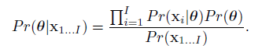

# Machine Vision

> Book: http://www.computervisionmodels.com/

The big goal of machine vision is to:

- Recognition
  - Character / Face / Object / Action
- Reconstruction
  - 2D image $\rightarrow$ 3D model
- Tracking
  - Follow object in video
- Navigation
- Segmentation
- Enhancement Synthesis
- ...

Applications includes:

- Autonomous Vehicles
- Security
- Text Recognition
- Augmented Reality
- Image Retrieval
- Medical Image Analysis
- Model Building
- ...

History:

- 1970s: low level vision with binary images
- 1980s:  close with animal vision
- 1990s: estimation of camera pose and scene geometry
- 2000s: close with ML, CNN...

## Introduction

Machine Vision is hard because of (1) its dimensionality, all combinations of pixel values is a huge number (though we will never see most of them); (2) It is a inverse problem, i.e. the mapping from scene to image is many-to-one, it is not unique; (3) real-time is hard because video contains many data. Luckily, we know about how graphics works, have prior knowledge that expects what we will see in the image (help non-uniqueness), and there are huge data available.

## Overview

1. Probability

   - Joint probability

   - Conditional probability

   - Independence

   - Bayes’ rule

   - Common probability distributions

   - How to fit distributions to data

   - The multivariate normal

2. ML for vision: infer world from data

   - Model for regression (Discriminative)

     - Linear & non-linear regression
     - Gaussian process regression
     - The relevance vector machine

     - Models for classification (Discriminative)
       - Logistic regression
       - Gaussian process classification
       - Boosting and classification trees

   - Model complex PDFs (Generative)
     - EM algorithm
     - Mixture models
     - t-distributions
     - Factor Analysis

3. Connecting Models

   - Conditional Independence

   - Graphical Models

   - Inference on tree-structured models

   - Pictorial Structures

   - Undirected models

   - Markov random fields

   - Graph cuts

4. Models of Shape

   - Point distribution model

   - Active Shape Models

   - Active appearance models

5. Tracking

   - The Kalman Filter

   - Extensions of the Kalman Filter

   - Particle Filtering

6. Face Recognition

   - Subspace models for recognition

   - Within- and between- individual variance

   - Recognition across pose

7. Geometry of a Single Camera

   - Image transformations
   - How do 3d points project to pixels
   - Special cases of imaging

8. Geometry of multiple cameras

   - Stereo vision
   - Epipolar geometry
   - Finding and matching distinctive keypoints 
   - Shape from silhouette

## Probability

- **Random Variable** Output of a function that you do not know the input, the function can be discrete or continuous.

- **Probability** Probability of a output from a random variable.

- **Joint Probability** Probability of two random variable outputs happen together.
  $$
  \begin{split}
  Pr(x|y)&=\frac{Pr(x,y)}{Pr(y)}
  \end{split}
  $$

- **Bayes Rule**
  $$
  \begin{split}
  Pr(y|x)=\frac{Pr(x|y)Pr(y)}{Pr(x)}
  \end{split}
  $$
  $Pr(y)$ can be seem as remove the denominator in $Pr(x|y)$ to get $Pr(x,y)$ and add $Pr(x)$ to get $Pr(y|x)$.

- **Expectation**
  $$
  E[f(x)]=\int{f(x)Pr(x)}\; dx
  $$

  - Calculating the expectation requires us to know probability of each input.

  > TODO: what is moment

### Probability Distributions

> The explicit formula is not discussed, they are created by mathematician for us to model probabilistic distribution to have some mathematically convenient properties.

### Bernoulli

> univariant, discrete, binary

$$
Pr(x)=Bern_x[\lambda]
$$

where
$$
\begin{align*}
Pr(1)&=\lambda\\
Pr(0)&=1-\lambda\\

\lambda&\in [0, 1]\\
x&\in\{0, 1\}

\end{align*}
$$
Or in one line:
$$
Pr(x)=\lambda^x(1-\lambda)^{1-x}
$$
- A probability distribution for two discrete values.

### Beta

> univariant, continuous, multivalues

$$
Pr(\lambda)=Beta_\lambda[\alpha, \beta]
$$

Beta distribution is used to represent a distribution of a value ranged between 0 and 1, called $\lambda$, controlled by $\alpha$ and $\beta$.

- The ratio of $\alpha$ and $\beta$ determine where the peak/expectation is.
- As the magnitude of $\alpha$ and $\beta$ increases, the steepness/concentration of the peak/expectation increase.
- This can be seen as an input for Bernoulli distribution.
- Expectation can be calculated as $\frac{\alpha}{\alpha+\beta}$.

> TODO: usage

### Categorical

- multi-values version of Bernoulli distribution.
  - Each value $x_i$ follows $Pr(x=x_i)=\lambda_i$ and $Pr(x\neq x_i)=1-\lambda_i$.

### Dirichlet

- Continuous version of Categorical distribution.
- Multi-values version of Beta distribution.
  - Relative ratio of $a_{i\in K}$ determine the peak/expectation value.
  - Absolute value of $a_{i\in K}$ determine the height/concentration of the peak.

### Univariate Normal

- $\mu$ describe the position of the peak.
- $\sigma$ describe the variance/width of the distribution.

### Normal Inverse Gamma

We model the distribution of the $\mu$ and $\sigma$ using 4 parameters: 

- $\alpha$: control the position of center, up or down.
- $\beta$: controls the spread of the center within the variance.
- $\gamma$: control the spread of variance.
- $\delta$: control the position of the center, left or right.

### Multivariate Normal

- multi-value version of univariate normal
  - multiple positions, multiple variances, each control its own axes.

### Normal Inverse Wishart

- Suitable for describing uncertainty in the parameters of a multivariate normal distribution. Similar to Beta describing the parameter of Bernoulli; and normal inverse gamma describing parameters of univariate normal.
- It is just a function that produces a positive value for any valid mean vector µ and covariance matrix Σ, such that when we integrate over all possible values of µ and Σ, the answer is one.

- α spread of covariance
- Ψ average covariance
- γ spread of mean
- δ average mean

### Conjugate

|                     | conjugate(*similar*) to |                             |
| ------------------- | ----------------------- | --------------------------- |
| Bernoulli           |                         | Beta                        |
| categorical         |                         | dirichlet                   |
| univariate normal   |                         | normal-scaled inverse gamma |
| multivariate normal |                         | normal inverse wishart      |

When we multiply a distribution with its conjugate, the result is proportional to a new distribution which has the same form as the conjugate. For example:
$$
\operatorname{Bern}_{x}[\lambda] \cdot \operatorname{Beta}_{\lambda}[\alpha, \beta]=\kappa(x, \alpha, \beta) \cdot \operatorname{Beta}_{\lambda}[\tilde{\alpha}, \tilde{\beta}]
$$
where κ is a scaling factor that is constant respect to our variables. Proof:
$$
\begin{aligned}
\operatorname{Bern}_{x}[\lambda] \cdot \operatorname{Beta}_{\lambda}[\alpha, \beta] &=\lambda^{x}(1-\lambda)^{1-x} \frac{\Gamma[\alpha+\beta]}{\Gamma[\alpha] \Gamma[\beta]} \lambda^{\alpha-1}(1-\lambda)^{\beta-1} \\
&=\frac{\Gamma[\alpha+\beta]}{\Gamma[\alpha] \Gamma[\beta]} \lambda^{x+\alpha-1}(1-\lambda)^{1-x+\beta-1} \\
&=\frac{\Gamma[\alpha+\beta]}{\Gamma[\alpha] \Gamma[\beta]} \frac{\Gamma[x+\alpha] \Gamma[1-x+\beta]}{\Gamma[x+\alpha+1-x+\beta]} \operatorname{Beta}_{\lambda}[x+\alpha, 1-x+\beta] \\
&=\kappa(x, \alpha, \beta) \cdot \operatorname{Beta}_{\lambda}[\tilde{\alpha}, \tilde{\beta}]
\end{aligned}
$$

## Fitting data to normal distribution

- The input data: $X$.
- The size of $X$: $I$.

### Maximum Likelihood

We estimate the parameters using:
$$
\begin{aligned}
\hat{\boldsymbol{\theta}} &=\underset{\boldsymbol{\theta}}{\operatorname{argmax}}\left[\operatorname{Pr}\left(\mathbf{x}_{1 \ldots I} \boldsymbol{\theta}\right)\right] \\
&=\underset{\boldsymbol{\theta}}{\operatorname{argmax}}\left[\prod_{i=1}^{I} \operatorname{Pr}\left(\mathbf{x}_{i} \mid \boldsymbol{\theta}\right)\right]
\end{aligned}
$$
This is because in order to achieve maximum, $\theta$ must be configured such that its distribution closely fits the actual data $x_i$, because $Pr(x|\theta)=Pr(x,\theta)/Pr(\theta)$, by assuming that the distribution of $\theta$ is uniform, we need to maximize the overlapping area of $\theta$ and $x$, this is achieved when $\theta$ and $x$ have the same shape, i.e. same distribution.

To do this, we calculate the mean and variance of the data, in the case of modeling using Gaussian distribution.
$$
\begin{align*}
\hat{\mu}&=\text{mean}(X)&=&\frac{\sum_{i=1}^I(x_i)}{I}\\
\hat{\sigma}^2&=\text{variance(X)}&=&\frac{\sum_{i=1}^{I}(x_i-\hat{\mu})^2}{I}
\end{align*}
$$

### Maximize a Posterior

Now, what if our prior is not uniform? i.e. we already had some previous data available that hints us about what will happen. the prior $\hat{\mu}$ and $\hat{\sigma}^2$, which allow us to configure out the probability of the new  $\hat{\mu}$ and $\hat{\sigma}^2$ given the old  $\hat{\mu}$ and $\hat{\sigma}^2$. So we do:

$$
\begin{aligned}
\hat{\boldsymbol{\theta}} &=\underset{\boldsymbol{\theta}}{\operatorname{argmax}}\left[\operatorname{Pr}\left(\boldsymbol{\theta} \mid \mathrm{x}_{1 \ldots I}\right)\right] \\
&=\underset{\boldsymbol{\theta}}{\operatorname{argmax}}\left[\frac{\operatorname{Pr}\left(\mathrm{x}_{1 \ldots I} \mid \theta\right) \operatorname{Pr}(\boldsymbol{\theta})}{\operatorname{Pr}\left(\mathrm{x}_{1 \ldots I}\right)}\right] \\
&=\underset{\boldsymbol{\theta}}{\operatorname{argmax}}\left[\frac{\prod_{i=1}^{I} \operatorname{Pr}\left(\mathrm{x}_{i} \mid \boldsymbol{\theta}\right) \operatorname{Pr}(\boldsymbol{\theta})}{\operatorname{Pr}\left(\mathrm{x}_{1 \ldots I}\right)}\right]\\
&=\underset{\boldsymbol{\theta}}{\operatorname{argmax}}{\prod_{i=1}^{I} \operatorname{Pr}\left(\mathrm{x}_{i} \mid \boldsymbol{\theta}\right) \operatorname{Pr}(\boldsymbol{\theta})}

\end{aligned}
$$

### Bayesian

Here instead of trying to predict a certain $\hat{\theta}$, we compute a probability distribution for all $\theta$ using bayesian rule:

when given a new data, we compute its probability using:

It is probability of new data given a configuration, multiply by the probability of that configuration.

The goal is to calculate the probability of each configuration:
$$
P(\theta \mid D)=\frac{\overbrace{P(D \mid \theta)}^{likelihood} \overbrace{P(\theta)}^{prior}}{P(D)}=\frac{P(D \mid \theta) P(\theta)}{\int_{\theta} P(D \mid \theta) P(\theta) d \theta}
$$

### Comparison

> https://towardsdatascience.com/mle-map-and-bayesian-inference-3407b2d6d4d9

ML maximize $P(x|\theta)$ and MAP maximize $P(\theta|x)$, they return a single value, thus point estimator. Bayesian inference calculates the full posterior distribution, thus it return a PDF.

- Other point estimator exists such as expect a posterior (EAP)

### Covariance

Here we introduce three type of covariances:
$$
\boldsymbol{\Sigma}_{\text {spher }}=\left[\begin{array}{cc}
\sigma^{2} & 0 \\
0 & \sigma^{2}
\end{array}\right] \quad \boldsymbol{\Sigma}_{\text {diag }}=\left[\begin{array}{cc}
\sigma_{1}^{2} & 0 \\
0 & \sigma_{2}^{2}
\end{array}\right] \quad \boldsymbol{\Sigma}_{\text {full }}=\left[\begin{array}{cc}
\sigma_{11}^{2} & \sigma_{12}^{2} \\
\sigma_{21}^{2} & \sigma_{22}^{2}
\end{array}\right]
$$

- Spherical: scaled identity.
- Diagonal: diagonal.
- Full: symmetric and positive definite.

### Properties

If we have normal distribution of variable $x$:
$$
Pr(x)=\operatorname{Norm}_x[\mathbf{\mu}, \mathbf{\Sigma}]
$$
Then we have variable $y=Ax+b$ then its corresponding normal distribution is:
$$
Pr(x)=\operatorname{Norm}_x[A\mu+b, A\Sigma A^T]
$$
So to draw a sample of any distribution by transforming it from the standard normal distribution (mean 0, covariance identity), we first draw $x$ from a normal distribution, then apply $y=\Sigma^{-1}x+\mu$.

> TODO: how is this dervied

- If we marginalize a multi-variate normal, then the result also follows normal distribution

- If we condition on a subset of multi-variate normal on the using the rest of the variables, the conditioned distribution is also normal.

- The product of two normal distribution is also another normal distribution:
  $$
  \begin{aligned}
  \operatorname{Norm}_{\mathbf{x}}[\mathbf{a}, \mathbf{A}] \operatorname{Norm}_{\mathbf{x}}[\mathbf{b}, \mathbf{B}] =
  \kappa \cdot \operatorname{Norm}_{\mathbf{x}} {\left[\left(\mathbf{A}^{-1}+\mathbf{B}^{-1}\right)^{-1}\left(\mathbf{A}^{-1} \mathbf{a}+\mathbf{B}^{-1} \mathbf{b}\right),\left(\mathbf{A}^{-1}+\mathbf{B}^{-1}\right)^{-1}\right] }
  \end{aligned}
  $$
  

- If  we have normal distribution over a variable $x=Ay+b$, then we can express the same normal distribution in term of $y=A'x+b'$ as well. It is often used in bayesian rule to move $P(x|y)$ to  $P(y|x)$.

## Computer Vision

We take visual data $x$, infer world state $w$ (discrete/continuous), the measure data $x$ is often noisy and can map to many $w$, so best we can do is return a posterior distribution $P(w|x)$. We need **model**  to relate $x$ and $w$; **learning algorithm** that takes a pair of $(x_i, w_i)$ to fit parameters $\theta$; and an **inference algorithm** that takes the model and a new $x$ and return the probability distribution of the world $P(w|x,\theta)$, or draw sample from learned posterior.

- Inference is simpler with discriminative model, because we can directly compute $P(w|x)$; generative model make inference via bayesian rule which can be computational expensive.
- Generative model is built on $P(x|w)$ and discriminative model built on $P(w|x)$. Since the world space can be much smaller than the data, e.g. image space vs some aspect of the world, it may be more costly to build discriminative model.
  Secondly, the parameter used to describe the data maybe much larger than describing the world, even thought both configuration describing the data maybe referring to the same world state, and these redundancy can be expensive.
- The process of how data is created is more close to $P(x|w)$, we can account for perspective projection and occulusion, other approach requires learning these phenomena from the data.
- Generative model model the joint distribution over all data dimensions and can effectively interpolate missing elements.
- Generative model allows us to use expert prior knowledge as prior, which is harder for discriminative model.

Generative models are more common.

Applications include: skin detection and background subtraction.

## Normal Distribution

### Why multivariate model may not work

- It is unimodal, may not represent well by a single peak.
- not robust, single outlier can dramatically affects the estimate of the mean and covariance.
- too many parameters, the covariance matrix contains $D(D+1)/2$ parameters, sometimes forced to use diagonal form.

### Hidden Variable

Just a unknown distribution, we will then have a joint probability and we will marginalize it out later:
$$
\operatorname{Pr}(\mathbf{x} \mid \boldsymbol{\theta})=\int \operatorname{Pr}(\mathbf{x}, \mathbf{h} \mid \boldsymbol{\theta}) d \mathbf{h}
$$
The model involved often have hidden variable, in these cases, it will have neat close form solution only if we consider the hidden variable (which we cannot as it is hidden). We now need to apply non-linear optimization techniques or the expectation maximization algorithm to the right hand side of below equation, similar to ML:
$$
\hat{\boldsymbol{\theta}}=\underset{\boldsymbol{\theta}}{\operatorname{argmax}}\left[\sum_{i=1}^{I} \log \left[\int \operatorname{Pr}\left(\mathbf{x}_{i}, \mathbf{h}_{i} \mid \boldsymbol{\theta}\right) d \mathbf{h}_{i}\right]\right]
$$

### EM Algorithm

> skipped

### Mixture of Gaussian

Mixture of Gaussian is a model that suitable for EM algorithm, it describe data as sum of $K$ normal distributions.
$$
\begin{aligned}
\hat{\boldsymbol{\theta}} &=\underset{\boldsymbol{\theta}}{\operatorname{argmax}}\left[\sum_{i=1}^{I} \log \left[\operatorname{Pr}\left(\mathbf{x}_{i} \mid \boldsymbol{\theta}\right)\right]\right] \\
&=\underset{\boldsymbol{\theta}}{\operatorname{argmax}}\left[\sum_{i=1}^{I} \log \left[\sum_{k=1}^{K} \lambda_{k} \operatorname{Norm}_{\mathbf{x}_{i}}\left[\boldsymbol{\mu}_{k}, \boldsymbol{\Sigma}_{k}\right]\right]\right]
\end{aligned}
$$
where $\lambda_k$ is the weight for each normal distribution that sums to one. Unfortunately, the summation inside logorithm precludes a simple solution, non-linear optimization techniques are good but it would be better to maintain constraints on the parameters, i.e. $\lambda_k$ sums to one and covariances must be positive definite.

> TODO: skipped: ~pg115
>
> - Mixture of Gaussians as a marginalization
> - Expectation maximization for fitting mixture models

- It is important to include priors over model parameters $P(\theta)$ to prevent Gaussian exclusively associate with one single data point; as the variance of it will get smaller and likelihood increases without bound.

- It is also sensitive to outlier as mentioned
  

### t-distribution

We can use student distribution (t-distribution) which is closely related with normal distribution but allowed to parameterize the length of the tail:
$$
\begin{aligned}
\operatorname{Pr}(x) &=\operatorname{Stud}_{\mathbf{x}}\left[\mu, \sigma^{2}, \nu\right] \\
&=\frac{\Gamma\left[\frac{\nu+1}{2}\right]}{\sqrt{\nu \pi \sigma^{2}} \Gamma\left[\frac{\nu}{2}\right]}\left(1+\frac{(x-\mu)^{2}}{\nu \sigma^{2}}\right)^{-\frac{\nu+1}{2}}
\end{aligned}
$$
The degree of freedom $v\in(0,\infin]$ controls the length of the tail.

> TODO: skipped pg119
>
> - pdf
> - t-distribution as a marginalization
> - Expectation maximization for fitting t-distributions

### Factor Analysis

Dimensionality is the last problem we have for Gaussian distribution here, with an image of $60\times60$, each pixels containing $3$ RGB values, we have $60\times60\times 3=10800$ values, to model its covariance, the matrix will have $10800\times10800$ entries which is too much for today's computer. The diagonal form contains fewer parameters but this is much simplification --- we are assuming each pixels are independent which is clearly not true.

The factor analyzer is a linear subspace of a higher dimension that can be reached via a linear combination of a set of basis functions. It can be seen as modeling part of the high dimensions with a full model and mops up the remaining variations in a diagonal model. In general, $D$-dimension contains $1\dots D-1$ dimension subspaces. Its PDF is:
$$
  \operatorname{Pr}(\mathbf{x})=\operatorname{Norm}_{\mathbf{x}}\left[\boldsymbol{\mu}, \boldsymbol{\Phi} \boldsymbol{\Phi}^{T}+\mathbf{\Sigma}\right]
$$
where $\boldsymbol{\Phi}\boldsymbol{\Phi}^T$ is the covariance model over the subspace and each of its $K$ columns are termed *factors*, they are the set of directions where the data covary the most.

  > TODO skipped: 126
  >
  > -  Expectation maximization for learning factor analyzers
  > - Combining models
  > - Expectation maximization in detail

  ### Applications

  - Face detection
  - Object recognition
  - Segmentation
  - Frontal face recognition
  - Changing face pose (regression)

  > skipped pg140: Transformations as hidden variables

## Regression

Regression is discriminative, modeled as:
$$
\operatorname{Pr}\left(w_{i} \mid \mathbf{x}_{i}, \boldsymbol{\theta}\right)=\operatorname{Norm}_{w_{i}}\left[\phi_{0}+\boldsymbol{\phi}^{T} \mathbf{x}_{i}, \sigma^{2}\right]
$$
where $\phi_0$ can be seem as the y-intercept of a hyperplane and $\boldsymbol{\phi}^T$ can be seem as the gradient wrt each of data's dimension. We can simplified the notation by pre-pending $1$ to $\boldsymbol{x}$ and $\phi_0$ to $\boldsymbol{\phi}^{T}$:
$$
\operatorname{Pr}\left(w_{i} \mid \mathbf{x}_{i}, \boldsymbol{\theta}\right)=\operatorname{Norm}_{w_{i}}\left[\boldsymbol{\phi}^{T} \mathbf{x}_{i}, \sigma^{2}\right]
$$
Furthermore since each training sample is independent we can write:
$$
\operatorname{Pr}(\mathbf{w} \mid \mathbf{X})=\operatorname{Norm}_{\mathbf{w}}\left[\mathbf{X}^{T} \boldsymbol{\phi}, \sigma^{2} \mathbf{I}\right]
$$
For maximum likelihood, we seek:
$$
\begin{aligned}
\hat{\boldsymbol{\theta}} &=\underset{\boldsymbol{\theta}}{\operatorname{argmax}}[\operatorname{Pr}(\mathbf{w} \mid \mathbf{X}, \boldsymbol{\theta})] \\
&=\underset{\boldsymbol{\theta}}{\operatorname{argmax}}[\log [\operatorname{Pr}(\mathbf{w} \mid \mathbf{X}, \boldsymbol{\theta})]]
\end{aligned}
$$
Substituting we get:
$$
\hat{\boldsymbol{\phi}}, \hat{\sigma}^{2}=\underset{\boldsymbol{\phi}, \sigma^{2}}{\operatorname{argmax}}\left[-\frac{I \log [2 \pi]}{2}-\frac{I \log \left[\sigma^{2}\right]}{2}-\frac{\left(\mathbf{w}-\mathbf{X}^{T} \boldsymbol{\phi}\right)^{T}\left(\mathbf{w}-\mathbf{X}^{T} \boldsymbol{\phi}\right)}{2 \sigma^{2}}\right]
$$

$$
\begin{aligned}
\hat{\boldsymbol{\phi}} &=\left(\mathbf{X X}^{T}\right)^{-1} \mathbf{X} \mathbf{w} \\
\hat{\sigma}^{2} &=\frac{\left(\mathbf{w}-\mathbf{X}^{T} \boldsymbol{\phi}\right)^{T}\left(\mathbf{w}-\mathbf{X}^{T} \boldsymbol{\phi}\right)}{I}
\end{aligned}
$$

### Problems

- Predictions are overconfident, small changes of the slope can introduce large changes as we move away from the y-intercept, which is not reflected in the posterior distribution.
- Limited to linear functions which has no reason for real world data to be.
- High dimensional data with redundant information can result in unnecessary complexity in the resulting model.

### Bayesian linear regression

To tackle overconfidence, we can compute a probability distribution of the parameter $\phi$, during inference we take a weighted average of them. We can also add prior to it easily.

- The resulting posterior distribution is always narrower than the posterior, therefore it can only be used to refine the distribution.
- It is less confidence as the data departs from the mean because uncertainty in the gradient causes increasing uncertainty in the predictions as we move further away.

To implement, we have the close form:
$$
\operatorname{Pr}(\phi \mid \mathbf{X}, \mathbf{w}) =\operatorname{Norm}_{\phi}\left[\frac{1}{\sigma^{2}} \mathbf{A}^{-1} \mathbf{X} \mathbf{w}, \mathbf{A}^{-1}\right]
$$
where:
$$
\mathbf{A} =\frac{1}{\sigma^{2}} \mathbf{X} \mathbf{X}^{T}+\frac{1}{\sigma_{p}^{2}} \mathbf{I}
$$
To make inference with new data $x^*$, we take the infinite weighted sum (integral) for all possible configurations compute:
$$
\begin{aligned}
\operatorname{Pr}\left(w^{*} \mid \mathbf{x}^{*}, \mathbf{X}, \mathbf{w}\right) &=\int \operatorname{Pr}\left(w^{*} \mid \mathbf{x}^{*}, \boldsymbol{\phi}\right) \operatorname{Pr}(\boldsymbol{\phi} \mid \mathbf{X}, \mathbf{w}) d \boldsymbol{\phi} \\
&=\int \operatorname{Norm}_{w^{*}}\left[\phi^{T} \mathbf{x}^{*}, \sigma^{2}\right] \operatorname{Norm}_{\boldsymbol{\phi}}\left[\frac{1}{\sigma^{2}} \mathbf{A}^{-1} \mathbf{X} \mathbf{w}, \mathbf{A}^{-1}\right] d \boldsymbol{\phi} \\
&=\operatorname{Norm}_{w^{*}}\left[\frac{1}{\sigma^{2}} \mathbf{x}^{* T} \mathbf{A}^{-1} \mathbf{X} \mathbf{w}, \mathbf{x}^{* T} \mathbf{A}^{-1} \mathbf{x}^{*}+\sigma^{2}\right]
\end{aligned}
$$
The result is a constant in the normal distribution $w^*$.

We need to compute $A^{-1}$ which can be huge matrix for large $D$, but luckily we can use Woodbury identity to rewrite $A^{-1}$ as:
$$
\mathbf{A}^{-1}=\left(\frac{1}{\sigma^{2}} \mathbf{X X}^{T}+\frac{1}{\sigma_{p}^{2}} \mathbf{I}_{D}\right)^{-1}=\sigma_{p}^{2} \mathbf{I}_{D}-\sigma_{p}^{2} \mathbf{X}\left(\mathbf{X}^{T} \mathbf{X}+\frac{\sigma^{2}}{\sigma_{p}^{2}} \mathbf{I}_{I}\right)^{-1} \mathbf{X}^{T}
$$
We still need to inverse but it is now the size $I\times I$ where $I$ is the number of samples.

> TODO: substitute this shit back into the equation to form a larger shit
>
> - fitting variance

### Non-linear regression

> TODO: skipped
>
> - Bayesian nonlinear regression

### Kernels and the kernel trick

bayesian non-linear regression is rarely used because it is costly to compute $z_i^Tz_i$ in the predictive distribution when the transformed space (by the radial function $z_i=f[x_i]$) is high-dimensional. An alternative is to define a kernel function $k[x_i,x_j]$ that replace $f[x_i]^Tf[x_i]$, this way we can project data to high dimensional space with low cost. 

Kernel need to be symmetric and corresponding to some $f[x_i]$, specifically, Mercer’s theorem states that a kernel function is valid when the kernel’s arguments are in a measurable space, and the kernel is positive semidefinite so that:
$$
\sum_{i j} \mathrm{k}\left[\mathbf{x}_{i}, \mathbf{x}_{j}\right] a_{i} a_{j} \geq 0
$$
for any finite set $\{x_n\}_{n=1}^N$. Some examples:

- linear
- degreee $p$ polynomial
- radial bases function (RBF) / gaussian.

### Gaussian process regression

is when kernel is used.

### Sparse linear regression

Goal is to find the gradient vector where most entries are zeros.

- faster as we no longer need to make all measurements
- encourage model to capture the main trend without over-fitting

It is done by imposing an penalty over gradient parameters $\boldsymbol{\phi}=[\phi_1,\phi_2,\dots,\phi_D]^T$ with a product of one-dimensional t-distributions so that
$$
\begin{aligned}
\operatorname{Pr}(\boldsymbol{\phi}) &=\prod_{d=1}^{D} \operatorname{Stud}_{\phi_{d}}[0,1, \nu] \\
&=\prod_{d=1}^{D} \frac{\Gamma\left(\frac{\nu+1}{2}\right)}{\sqrt{\nu \pi} \Gamma\left(\frac{\nu}{2}\right)}\left(1+\frac{\phi_{d}^{2}}{\nu}\right)^{-(\nu+1) / 2}
\end{aligned}
$$
The product of univariate t-distributions has ridges of high probability along the coordinate axes, which encourages sparseness.

However, if the transformed data z is very high-dimensional, we will need correspondingly more hidden variables $h_d$ to cope with these dimensions. Obviously, this idea will not transfer to kernel functions where the dimensionality of the transformed data could be infinite. Therefore we have relevance vector machine.

> skipped: pg 163
>
> - Dual linear regression
> - Relevance vector regression

### Applications

- Human body pose estimation
- Displacement experts

## Classification Models

> TODO: trees forest boosting

> TODO: dependent variables graphs
