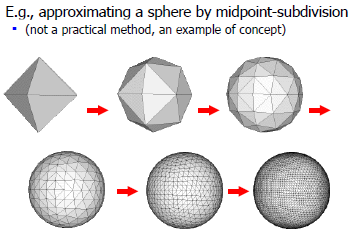
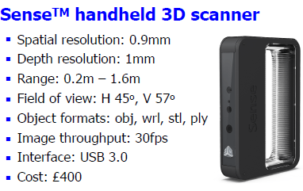
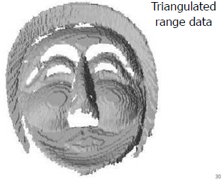

# Computer Graphics

Polygons are powerful, but it is bad in stimulating liquid, fluid flow, fire smoke, mountains, trees, bushes... They are not polygon. Let's look at **Generative Modelling**.

## Generative Modelling

### Fractal Modelling

For self-similar structure, repeats itself recursively. Example include 3D terrain generation. To model a fractal curve, one approach would be recursively subdivide a line by taking mid point of a fragment and displace it randomly. (Does it has infinite diameter? Area?)


- Fractal dimension is a measurement of roughness.

### Grammar based Modelling

Use production rules to define objects, e.g. F=forward, L=turn-left, R=turn-right


We can apply rule recursively.

We can also use this to model natural forms, using a L-system (Lindenmayer systems), e.g. flowers, trees

Example software: algorithmicbotany.org/virtual_laboratory


### Particle Systems

We can also model some phenomena using dynamic particles. They have a set of properties which change over time, e.g. shape, position, size, color, velocity, acceleration. 

To compute particle position, we can use the standard equation of motion:
$$
\begin{align*}
x_p&=v_pt \cos \beta_p\\
y_p&=v_pt \sin \beta_p-\frac{1}{2}gt^2
\end{align*}
$$
To update velocity we can use iterative method such as Euler integration:
$$
v_{t+1}=v_t + a.\Delta t
$$
where $v=\text{velocity}$, $a=\text{acceleration}$ and $t=\text{time}$. Or [verlet integration](https://goo.gl/gjTGs2) which compute position directly:
$$
v_{t+1}=2v_t-x_{t-1}+a.\Delta t^2
$$
When building such system, efficient & scalability is important as we can easily have millions of particles. Example algorithm:

```python
def new_frame():
    remove_particles_past_lifetime()
    create_new_particles()
    update_attribute()
    	- positions: collisions (evironment & inter-particles) detections
        - color, accelerations, etc...
    render_particles()
```

Particles system often driven by external scripts that defines rules, initial values, limits. The particles system engine reads them, set parameters accordingly and executes it. These particles are then rendered, here are some rendering ideas:

- anti-aliased
  
- splats / gaussian kernels (small groups of particles centered at true position)
  
- connect old & new position with a line instead of rendering particles
  
  Using this idea we can render stuff like grass:
  
- alpha texture quads
  

## Model Acquisition

#### by hand


#### interactive system (e.g. sketchup.com)


#### algorithm



#### CAD techniques


#### generative modelling


#### acquiring geometry directly


It is hard to extract geometry from image directly:

But human acquire 3d models all the time without conscious, an attempt to explain would be a iterative process that converge into a solution (Active Vision theory):

With some human intervention, very good result can be achieved.

#### laser scanning




#### geometry from images/videos


## Triangulate & Texture Integration

Geometry extracted / generated may not be perfect, they can have missing points / polygons which made it hard to map a texture onto it. Sometimes data we get are not even polygon (laser scanning), they are just set of points.

### Triangluation

There are many possible solution, some desired properties include

- regularity (triangles are of similar size)
- no degenerated triangles (v1 ~= v2 (~= v3)) (?)
- speed (time/space complexity)

One algorithm is **delaunary triangulation (1934)**, it is a delunary triangulation where every edge E is a delaunary edge. A delaunary edge is a edge connecting vertices A and B such that you can draw a circle connecting A and B without including another vertex.


```python
def delaunary_algorithm(points):
    triangles = set()
    dummy = create_triangle_surronding(points)
    triangles.add(dummy)
    
    while points.not_done_points > 0:
        point = random(points.not_done_points)
        triangle = find_enclosed(p, triangles)
        t1, t2, t3 = break_into_3_triangles(triangle, point)
        for t in [t1, t2, t3]:
            if not is_delaunary(t):
                t = swap_edges_around_until_it_is_delaunary(t, triangle)  # ?
            triangles.add(t)
        point.done = True
    return triangles
```




### Mesh Simplification

A lot of the time we have too many data, this cause space & time complexity and difficult to render in real life, thus we want to simplify the mesh by removing vertices but preserving shape. This is a ongoing research area, e.g. "Surface Simplification Using Quadratic Error Metrics", http://goo.gl/4kSIgP. One way is to collapse edges: 


### Occlusion

The captured data is often not perfect, which cause occlusion leading to gaps in the data.


If we using scanning and we only do one scan, then it is very likely that it cannot capture the whole model, one way to solve this is to take multiple range images and combine them. 

- The basic idea is to estimate a new surface that is closest to as many range points as possible. Paper: Zippered Polygon Meshes from Range Images https://dl.acm.org/citation.cfm?id=192241, graphics.stanford.edu/software/scanview
- Another way is to use volumetric diffusion: Paper: Filling holes in complex surfaces using volumetric diffusion http://graphics.stanford.edu/papers/holefill-3dpvt02

## Geometry From Images

